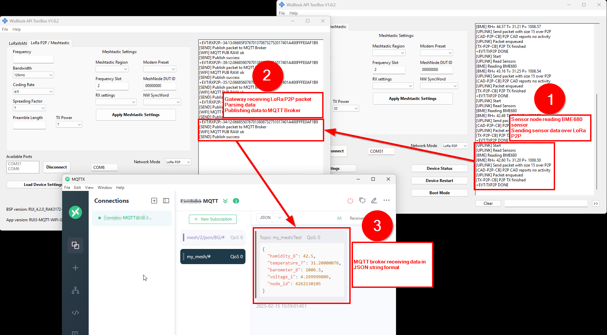

|  |  |  |    
| :-: | :-: | :-: |      
| |  | |

# How to build a LoRa P2P to MQTT Broker gateway with the RAK11160 WisDuo module

The WisDuo RAK11160 WisDuo provides LoRa, WiFi and BLE connectivity in one single module.    
This makes it the perfect choice to build a gateway between the long range LoRa world and the cloud, or specifically here to an MQTT broker.    

In this tutorial we will use a RAK11160 to setup a gateway between a sensor node that is sending data over LoRa P2P.    
The RAK11160 is setup to receive these data, parse it into a JSON packet and send it to an MQTT broker.     

For testing, a WisBlock Kit 4 flashed with the [RAK4631-Kit-4-RAK1906](https://github.com/beegee-tokyo/RAK4631-Kit-4-RAK1906) or [RUI3-WisBlock-Kit-4](https://github.com/RAKWireless/RUI3-Best-Practice/tree/main/RUI3-WisBlock-Kit-4) example application is used as the sensor node, but any other sensor node that is sending its sensor data in Cayenne LPP format will work as well (But might require changes in the [data parser](./parse.cpp)). 

_**INFO**_    
This example uses a simple username & password authentification for the MQTT broker.    
For a authentification with certifications please check the [Espressif ESP-AT User Guide ==> MQTT AT Examples for Cloud](https://docs.espressif.com/projects/esp-at/en/latest/esp32/AT_Command_Examples/mqtt-at-examples-for-cloud.html)    

## Hardware

### Gateway
For convenience this example uses the WisBlock Core RAK11162 which is equipped with a WisDuo RAK11160 stamp module.

[RAK11162 WisBlock Core](https://store.rakwireless.com/collections/wisblock-core)    
[RAK19007 WisBlock Base Board](https://store.rakwireless.com/products/rak19007-wisblock-base-board-2nd-gen)

### Sensor Node

[WisBlock Kit 4](https://store.rakwireless.com/products/wisblock-kit-4-air-quality-monitor)

## Software

### Gateway

The code provided in the example.

### Sensor Node

Arduino BSP based [Firmware RAK4631-Kit-4-RAK1906](https://github.com/beegee-tokyo/RAK4631-Kit-4-RAK1906)    
RUI3 based [RUI3-WisBlock-Kit-4](https://github.com/RAKWireless/RUI3-Best-Practice/tree/main/RUI3-WisBlock-Kit-4)

## Principle of communication

- **(1)** The Sensor node is sending its sensor data as a LoRa P2P packet as [Cayenne Low Power Payload](https://docs.mydevices.com/docs/lorawan/cayenne-lpp).
- **(2)** The Gateway is receiving the sensor data and decodes the data packet.
- **(3)** The Gateway sensd the data packet in JSON format to a MQTT broker.

<center></center>

## Indicators
If the device is built with the RAK11162 and a WisBlock Base Board, the two LED's on the Base Board are used as indicators.      
Blue LED
- blinking indicates MQTT activity
- if on permanently, connection to MQTT broker could not be established
Green LED
- blinking indicates WiFi setup
- on and blue LED blinking indicates WiFi activity
- if on permanently, connection to WiFi AP failed

## Setup

### LoRa P2P setup

To be able to receive the LoRa P2P data, both the sensor node and the gateways LoRa transceiver must be setup to the same parameters. This setup is _**NOT**_ done in the application itself, to be flexible for different country legal restrictions, the setup is done with AT commands.     
The AT commands are identical for both the sensor node and the gateway:

Set LoRa P2P mode (device might reset after this command)
```
AT+NWM=0
```
| Parameter | Value        | Range                     |
| --------- | ------------ | ------------------------- |
| `0`       | Network mode | 0 = LoRa P2P, 1 = LoRaWAN | 

Set LoRa P2P parameters
```
AT+P2P=916000000:7:0:0:8:22
```
| Parameter   | Value            | Range                                                                                      |
| ----------- | ---------------- | ------------------------------------------------------------------------------------------ |
| `916000000` | LoRa frequency   | 864000000-960000000 (high frequency variant) or 43300000-490000000 (low frequency variant) | 
| `7`         | Spreading factor | 6 to 12                                                                                    |
| `0`         | Bandwidth        | 0=125, 1=250, 2=500, 3=7.8, 4=10.4, 5=15.63, 6=20.83, 7=31.25, 8=41.67, 9=62.5             |
| `0`         | Coding Rate      | 0 = 4/5, 1 = 4/6, 2 = 4/7, 3 = 4/8=3                                                       |
| `8`         | Preamble Lenght  | 2 - 65535                                                                                  |
| `22`        | TX power         | 5 - 22 (check local region legal restrictions)                                             |

## WiFi setup (only on gateway)

The setup of the WiFi parameter is only on the gateway. It is done via a custom AT command.    

Set WiFi and MQTT connection parameters
```
ATC+WIFI=MQTT_WIFI_APN:MQTT_WIFI_PW:MQTT_USER:MQTT_USERNAME:MQTT_PASSWORD:MQTT_URL:MQTT_PORT:MQTT_PUB
```
| Parameter       | Value                  | Range                                                           |
| --------------- | ---------------------- | --------------------------------------------------------------- |
| `MQTT_WIFI_APN` | WiFi AP name           | String, 32 bytes max lenght                                     |
| `MQTT_WIFI_PW`  | WiFi AP password       | String, 32 bytes max lenght                                     |
| `MQTT_USER`     | MQTT user ID           | String, 32 bytes max lenght                                     |
| `MQTT_USERNAME` | MQTT login name        | String, 32 bytes max lenght                                     |
| `MQTT_PASSWORD` | MQTT login password    | String, 32 bytes max lenght                                     |
| `MQTT_URL`      | MQTT URL or IP address | String, 32 bytes max lenght                                     |
| `MQTT_PORT`     | MQTT port              | Depends on MQTT broker, usually 1883 for connection without SSL |
| `MQTT_PUB`      | MQTT topic             | Topic to which the sensor data is published                     |

### Sensor send interval (only on the sensor node)

The interval in which the sensor node is sending its data can be setup with a custom AT command on the sensor node
```
ATC+SENDINT=60
```
| Parameter | Value         | Range                                                 |
| --------- | ------------- | ----------------------------------------------------- |
| `60`      | Send interval in seconds | 0 = off, 86400 = 86400 seconds or 24 hours | 

## Important communication details

The communication between the STM32WLE5 and the ESP8684 is through the UART1 of the STM MCU. The communication rate is 115200 baud.    
Response from the ESP8684 will be sent throught he same UART.    
It is required to parse the response. In this example, the parser is only checking of the response contains an _**OK**_, which means that the command was successfully processed.    

### Initialize WiFi and MQTT connection

The initialization is started by calling _**`init_connection()`**_.    
This function does
1) check if the ESP8684 is responding on the UART connection
2) sets the WiFi mode of the ESP8684
3) sets the WiFi credentials and connects to the WiFi AP
4) sets the MQTT credentials and connects to the MQTT Broker

#### init_connection

Calls WiFi and MQTT setup functions
<details>
  <summary>Show init_connection code</summary>

```cpp
bool init_connection(void)
{
	if (!init_wifi())
	{
		MYLOG("SETUP", "Init ESP8684 failed");
		return false;
	}
	else
	{
		// Initialize WiFi connection
		has_wifi_conn = connect_wifi();
		if (!has_wifi_conn)
		{
			MYLOG("SETUP", "WiFi connection failed");
			return false;
		}
		else
		{
			// Initialize MQTT Broker connection
			has_mqtt_conn = connect_mqtt();
			if (!has_mqtt_conn)
			{
				MYLOG("SETUP", "MQTT Broker connection failed");
				return false;
			}
			else
			{
				MYLOG("SETUP", "WiFi and MQTT Broker connected");
			}
		}
	}
	return true;
}
```
</details>

#### init_wifi
Initializes the UART connection and checks if the ESP8684 is responding
<details>
  <summary>Show init_wifi code</summary>

```cpp
bool init_wifi(bool restart)
{
	// Initialize Serial to ESP8684
	Serial1.begin(115200);
	pinMode(WB_ESP8684, OUTPUT);
	if (restart)
	{
		digitalWrite(WB_ESP8684, LOW);
		delay(1000);
	}
	// Enable ESP8684
	digitalWrite(WB_ESP8684, HIGH);
	// Wait for ESP8684 bootup
	time_t start = millis();
	while ((millis() - start) < 30000)
	{
		Serial1.println("AT");
		Serial1.flush();
		/** Expected response ********************
		AT

		OK
		*****************************************/
		if (wait_ok_response(10000, LED_WIFI))
		{
			// MYLOG("WIFI", "ESP8684 respond to AT: ==>\n%s\n<==\r\n", esp_com_buff);
			MYLOG("WIFI", "ESP8684 found");
			return true;
		}
		delay(500);
	}
	digitalWrite(LED_WIFI, LOW);

	// if analog input pin 1 is unconnected, random analog
	// noise will cause the call to randomSeed() to generate
	// different seed numbers each time the sketch runs.
	// randomSeed() will then shuffle the random function.
	randomSeed(analogRead(WB_A1));
	return false;
}
```
</details>

#### connect_wifi
Set the ESP8684 into station mode and starts connection to the WiFi AP
<details>
  <summary>Show connect_wifi code</summary>

```cpp
bool connect_wifi(void)
{
	// Clear send buffer
	memset(esp_com_buff, 0, 512);
	snprintf(esp_com_buff, 511, "AT+CWMODE=1,1\r\n");
	Serial1.printf("%s", esp_com_buff);
	Serial1.flush();
	/** Expected response ********************
	AT+CWMODE=1,1

	OK
	*****************************************/
	if (!wait_ok_response(10000, LED_WIFI))
	{
		MYLOG("WIFI", "WiFi station mode failed", esp_com_buff);
		return false;
	}
	digitalWrite(LED_WIFI, LOW);

	// Clear send buffer
	memset(esp_com_buff, 0, 512);
	snprintf(esp_com_buff, 511, "AT+CWJAP=\"%s\",\"%s\"\r\n", custom_parameters.MQTT_WIFI_APN, custom_parameters.MQTT_WIFI_PW);
	// MYLOG("WIFI", "Connect with ==>%s<==", esp_com_buff);
	Serial1.printf("%s", esp_com_buff);
	Serial1.flush();
	/** Expected response ********************
	AT+cwjap="<MQTT_WIFI_APN>","<MQTT_WIFI_PW>"
	WIFI DISCONNECT
	WIFI CONNECTED
	WIFI GOT IP

	OK
	*****************************************/
	if (wait_ok_response(10000, LED_WIFI))
	{
		// MYLOG("WIFI", "ESP8684 connected: ==>%s<==\r\n", esp_com_buff);
		MYLOG("WIFI", "ESP8684 connected");
		return true;
	}
	digitalWrite(LED_WIFI, LOW);

	MYLOG("WIFI", "ESP8684 not connected: ==>%s<==\r\n", esp_com_buff);
	return false;
}
```
</details>

#### connect_mqtt
Sets the MQTT credentials and connects to the MQTT broker
<details>
  <summary>Show connect_mqtt code</summary>

```cpp
bool connect_mqtt(bool restart)
{
	if (restart)
	{
		// Clear send buffer
		memset(esp_com_buff, 0, 512);
		snprintf(esp_com_buff, 511, "AT+MQTTCLEAN=0\r\n");
		// MYLOG("WIFI", "MQTT Clean with ==>%s<==", esp_com_buff);
		Serial1.printf("%s", esp_com_buff);
		Serial1.flush();
		/** Expected response ********************
		AT+MQTTCLEAN=0

		OK
		*****************************************/
		if (wait_ok_response(10000, LED_MQTT) == false)
		{
			MYLOG("WIFI", "MQTT CLEAN failed: ==>\n%s\n<==\r\n", esp_com_buff);
		}
		digitalWrite(LED_MQTT, LOW);
	}
	// Create random user
	uint16_t id = random(0, 65535);
	char mqtt_user[64];
	sprintf(mqtt_user, "%s%04X", custom_parameters.MQTT_USER, id);

	// Clear send buffer
	memset(esp_com_buff, 0, 512);
	snprintf(esp_com_buff, 511, "AT+MQTTUSERCFG=0,1,\"%s\",\"%s\",\"%s\",0,0,\"\"\r\n",
			 mqtt_user, custom_parameters.MQTT_USERNAME, custom_parameters.MQTT_PASSWORD);
	// MYLOG("WIFI", "MQTT USR setup with ==>%s<==", esp_com_buff);
	Serial1.printf("%s", esp_com_buff);
	Serial1.flush();
	/** Expected response ********************
	AT+MQTTUSERCFG=0,1,"<MQTT_USER>","<MQTT_USERNAME>","<MQTT_PASSWORD>",0,0,""

	OK
	*****************************************/
	if (wait_ok_response(10000, LED_MQTT) == false)
	{
		MYLOG("WIFI", "MQTT USR config failed: ==>\n%s\n<==\r\n", esp_com_buff);
		return false;
	}
	digitalWrite(LED_MQTT, LOW);
	// MYLOG("WIFI", "MQTT USR config ok: ==>%s<==\r\n", esp_com_buff);

	// Clear send buffer
	memset(esp_com_buff, 0, 512);
	snprintf(esp_com_buff, 511, "AT+MQTTCONN=0,\"%s\",%s,0\r\n",
			 custom_parameters.MQTT_URL, custom_parameters.MQTT_PORT);
	// MYLOG("WIFI", "MQTT Connect with ==>%s<==", esp_com_buff);
	Serial1.printf("%s", esp_com_buff);
	Serial1.flush();
	/** Expected response ********************
	AT+MQTTCONN=0,"<MQTT_URL>",<MQTT_PORT>,0
	+MQTTCONNECTED:0,1,"<MQTT_URL>","<MQTT_PORT>","",0

	OK
	*****************************************/
	if (wait_ok_response(10000, LED_MQTT) == false)
	{
		MYLOG("WIFI", "MQTT connect failed: ==>\n%s\n<==\r\n", esp_com_buff);
		return false;
	}
	digitalWrite(LED_MQTT, LOW);
	// MYLOG("WIFI", "MQTT connect ok: ==>%s<==\r\n", esp_com_buff);
	return true;
}
```
</details>

#### wait_ok_response
Each of the initialization functions and the MQTT publish function are using _**`wait_ok_response`**_ to get the response from the ESP8684 to the command.    
The function returns _**`true`**_ if the response includes an _**OK**_ and _**`false`**_ if there was no response, or if the response did not include _**OK**_.    

The second parameter of the functions allows to wait for a different response marker than _**OK**_.    

The full response of the ESP8684 is available in the _**`wtx_buf`**_ array for further parsing or analysis.    

<details>
  <summary>Show wait_ok_response code</summary>

```cpp
bool wait_ok_response(time_t timeout, uint8_t pin, char *wait_for)
{
	time_t start = millis();
	int buff_idx = 0;
	bool got_ok = false;

	// Clear TX buffer
	memset(esp_com_buff, 0, 512);

	while ((millis() - start) < timeout)
	{
		if (Serial1.available() != 0)
		{
			char rcvd = Serial1.read();
			// Serial.write(rcvd);
			// Serial.flush();
			esp_com_buff[buff_idx] = rcvd;
			buff_idx++;
			if (buff_idx == 512)
			{
				digitalWrite(pin, LOW);
				// Buffer overflow, return false
				return false;
			}

			if (strstr(esp_com_buff, wait_for) != NULL)
			{
				// Serial.println("RX OK");
				digitalWrite(pin, LOW);
				return true;
			}
		}
		digitalWrite(pin, !digitalRead(pin));
		delay(100);
	}
	digitalWrite(pin, LOW);
	return false;
}```
</details>

### Receive LoRa packets

If LoRa packets are received, the RUI3 API provides a callback to handle the received data. This callback has to setup in the application.    
<details>
  <summary>Show registerPRecvCallback code</summary>

```cpp
	// Setup LoRa P2P callbacks
	api.lora.registerPRecvCallback(recv_cb);
```
</details>

The callback itself can retrieve the information for the received packet from a structure. The callback itself should not handle the packet directly. Instead a timer is used to start the packet handling process.
<details>
  <summary>Show recv_cb code</summary>

```cpp
void recv_cb(rui_lora_p2p_recv_t data)
{
	// Add received data into FiFo Queue
	if (has_wifi_conn && has_mqtt_conn)
	{
		if (!Fifo.enQueue(data.Buffer, data.BufferSize))
		{
			// interrupts();
			MYLOG("RX-P2P-CB", "FiFo full");
			return;
		}
	}
	MYLOG("RX-P2P-CB", "%d FiFo entries ", Fifo.getSize());
	if (!wifi_sending)
	{
		MYLOG("RX-P2P-CB", "Handle Fifo");
		wifi_sending = true;
		// Activate send to WiFi function
		api.system.timer.start(RAK_TIMER_0, 100, NULL);
	}
}
```
</details>

⚠️ INFO
_**Parsing and forwarding the packets over WiFi can take longer than the interval between two received data packets.**_    
_**To avoid data loss, received packets are stored in a queue and sent one by one to the MQTT broker.**_      

### Parse incoming LoRa packets

⚠️ INFO
_**The parsing of the incoming LoRa packets is depending on the packet format being in Cayenne LPP format. It can handle only such data packets. The decoder itself recognizes only a limited number of potential data types.**_     
_**This limitation is required due to the limit Flash size of the STM32WLE5.**_    

The _**`parse`**_ function scans byte by byte through the received data array, checks for sensor types, sensor ID and extracts the sensor value depending on the type of the sensor.    

Sensor type, ID, value size and value multiplier are defined in 4 structures:
<details>
  <summary>Show structures</summary>

```cpp
/** Sensor ID's */
uint8_t value_id[NUM_DEFINED_SENSOR_TYPES] = {0, 1, 2, 3, 100, 101, 102, 103,
											  104, 112, 113, 115, 116, 117, 118, 120,
											  121, 125, 128, 130, 131, 132, 133, 134,
											  135, 136, 137, 138, 142, 188, 190, 191,
											  192, 193, 194, 195, 203, 255};

/** Sensor types */
uint8_t value_size[NUM_DEFINED_SENSOR_TYPES] = {1, 1, 2, 2, 4, 2, 1, 2,
												1, 2, 6, 2, 2, 2, 4, 1,
												2, 2, 2, 4, 4, 2, 4, 6,
												3, 9, 11, 2, 1, 2, 2, 2,
												2, 2, 2, 2, 1, 4};

/** Sensor data names */
String value_name[NUM_DEFINED_SENSOR_TYPES] = {"digital_in", "digital_out", "analog_in", "analog_out", "generic", "illuminance", "presence", "temperature",
											   "humidity", "humidity_prec", "accelerometer", "barometer", "voltage", "current", "frequency", "percentage",
											   "altitude", "concentration", "power", "distance", "energy", "direction", "time", "gyrometer",
											   "colour", "gps", "gps", "voc", "switch", "soil_moist", "wind_speed", "wind_direction",
											   "soil_ec", "soil_ph_h", "soil_ph_l", "pyranometer", "light", "node_id"};

/** Sensor value dividers */
uint32_t value_divider[NUM_DEFINED_SENSOR_TYPES] = {1, 1, 100, 100, 1, 1, 1, 10,
													2, 10, 1000, 10, 100, 1000, 1, 1,
													1, 1, 1, 1000, 1000, 1, 1, 100,
													1, 10000, 1000000, 1, 1, 10, 100, 1,
													1000, 100, 10, 1, 1, 1};
```
</details>

The full code is in [parse.cpp](./parse.cpp).    

The parsed values are stored in JSON format in the _**json_buffer**_ char array.    
If the parsing is successful, _**`parse()`**_ will return the size of the char array.    
If the parsing failed, the return value is 0.    

### Send data to the MQTT broker

After parsing the LoRa packet, the JSON char array is published to the defined topic via the _**`publish_raw_msg`**_ function.     
<details>
  <summary>Show publish_raw_msg code</summary>

```cpp
bool publish_raw_msg(char *sub_topic, uint8_t *message, size_t msg_len)
{
	// Clear send buffer
	memset(esp_com_buff, 0, 512);
	snprintf(esp_com_buff, 511, "AT+MQTTPUBRAW=0,\"%s%s\",%d,0,0\r\n",
			 custom_parameters.MQTT_PUB, sub_topic, msg_len);
	// MYLOG("WIFI", "MQTT Publish Raw ==>%s<==", esp_com_buff);
	Serial1.printf("%s", esp_com_buff);
	Serial1.flush();
	/** Expected response ********************
	OK
	>
	*****************************************/
	if (wait_ok_response(10000, LED_MQTT, ">") == false)
	{
		MYLOG("WIFI", "MQTT PUB RAW failed waiting for '>': ==>%s<==\r\n", esp_com_buff);
		return false;
	}
	digitalWrite(LED_MQTT, LOW);
	// Start sending data
	for (int idx = 0; idx < msg_len; idx++)
	{
		Serial1.write(message[idx]);
		delay(5);
	}
	if (wait_ok_response(60000, LED_MQTT) == false)
	{
		MYLOG("WIFI", "MQTT PUB RAW failed waiting for 'OK': ==>\n%s\n<==\r\n", esp_com_buff);
		return false;
	}
	digitalWrite(LED_MQTT, LOW);
	// MYLOG("WIFI", "MQTT PUB RAW ok: ==>%s<==\r\n", esp_com_buff);
	MYLOG("WIFI", "MQTT PUB RAW ok");
	return true;
}
```
</details>

----

# Get RUI3 devices

Get a RAKwireless RUI3 WisDuo stamp module, breakout board or evaluation board from our [store](https://store.rakwireless.com/collections/new-menu-modules)

Get a RAKwireless RUI3 WisBlock Core module from our [store](https://store.rakwireless.com/collections/wisblock-core)

----

# LoRa® is a registered trademark or service mark of Semtech Corporation or its affiliates. 

----

# LoRaWAN® is a licensed mark.