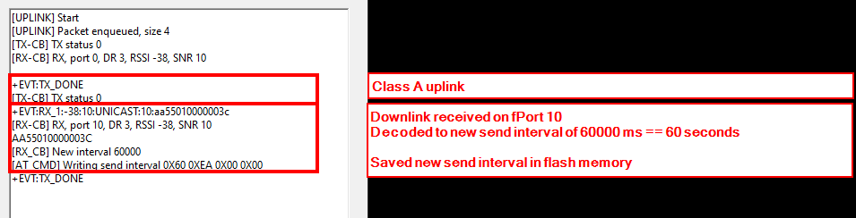

|  |  |  |    
| :-: | :-: | :-: |     

# How to use downlinks from the LoRaWAN server to change device settings

In some applications it might be required to change LoRaWAN settings dynamically from the LoRaWAN server.    
This example code shows how to change     
- send interval (ATC+SENDINT)
- data rate (AT+DR)
- automatic data rate adaption (AT+ADR)
- confirmed packet mode (AT+CFM)    

with downlinks from the LNS to the end node.

The downlinks with the commands are structured in the following scheme:

`<Marker1><Marker2><Command><Value1><Value2><Value3><Value4>`

Marker 1 is defined as 0XAA    
Marker 2 is defined as 0X55

The markers are used to distinguish between command downlinks and other downlinks

Command is the ID of the command to be executed and Value1 to Value4 are the new settings.

| Command ID | Command | Content of Value1 to Value4 |
| ---------- | ------- | --------------------------- |
| 0x01       | Change the send interval | Value1 to Value4 contain the new send interval in seconds.<br />Value1 is the MSB, Value4 is the LSB<br />All four values must be set.<br />interval time is send hex formated,<br />e.g. 600 seconds ==> Value1 = 0x00 Value2 = 0x00 Value3 = 0x02 Value4 = 0x58 |
| 0x02       | Change the data rate | Value1 is the new data rate.<br />value must be between 0 and 7.<br />Value2, Value3 and Value4 _**MUST**_ not be sent. |
| 0x03       | Enable/Disable the adaptive data rate setting | Value1 is the new adaptive data rate setting.<br />value = 0 ==> ADR off, value = 1 ==> ADR on.<br />Value2, Value3 and Value4 _**MUST**_ not be sent. |
| 0x04       | Enable/Disable the confirmed uplink mode | Value1 is the new uplink mode.<br />value = 0 ==> CFM off, value = 1 ==> CFM on.<br />Value2, Value3 and Value4 _**MUST**_ not be sent. |
| 0x05       | Restart the device | No values are used with this command.<br />Value1, Value2, Value3 and Value4 _**MUST**_ not be sent. |

> ### ⚠️ NOTE 
> Downlinks with commands have to be sent over fPort 10 in this PoC!

## How to send downlinks to the end device

There are multiple methods to invoke downloads to the end node. The methods differ between different LoRaWAN servers. Some LNS provide an interface to initiate downlinks. On most LNS it is as well possible to send downlinks through MQTT or API's.     

Here, as an easy example, the downlinks are initiated with the _**Enqueue*_ interface available on the Chirpstack V2 LNS.     
To access the _**Enqueue*_ interface, the device must be registered on the LNS in an application.    
1) Open the Chirpstack Web UI    
2) Open the Application in Chirpstack
3) Open the Device in the Application
4) Open the _**Queue**_ tab in the Device

<center>  </center>

The downlinks can be entered as plain HEX string, as Base64 decoded string or as JSON formatted data.     

<center>  </center>

## Create commands as HEX strings

The simpliest option to create a downlink is using the HEX format.    

Here are examples of the HEX strings for the different commands:
<center>

| Command | Hex String |
| ------- | ---------- |
| Change DR to 5 | AA550205 |
| Change DR to 3 | AA550203 |
| Enable ADR | AA550301 |
| Disable ADR | AA550300 |
| Enable Confirmed Uplink Mode | AA550401 |
| Disable Confirmed Uplink Mode | AA550400 |
| Restart device | AA5505 |

</center>

To change the send interval, the new value must first be converted to a 32bit HEX value. This can be done e.g. with [RapidTables](https://www.rapidtables.com/convert/number/decimal-to-hex.html?x=600).    

Here a send interval of 600 seconds is converted to a HEX value:

<center>  </center>

For the commands we need a HEX string for 32bit, so the HEX string `"0258"` must extended to `"00000258"` to be used.

The final command as HEX string will be

```log
AA550100000258
```

Make sure the FPort is set to _**`10`**_, otherwise the end node will ignore the command!

This HEX string should be entered in Chirpstack:

<center>  </center>

Then press 'Enqueue" to add the downlink to the downlink queue.    
The new downlink will be shown in the downlink queue.

> ### ⚠️ INFORMATION    
> The time the downlink will be sent to the device depends on the LoRaWAN class of the end device.    
> 
> | Device Class | Downlink send time                                                           |
> | ------------ | ---------------------------------------------------------------------------- |
> | Class A      | Downlink will be sent _**after the next uplink**_ received from the end node |
> | Class B      | Downlink will be sent _**in the next available RX window**_ of the end node  |
> | Class C      | Downlink will be sent _**immediately**_                                      |

Once the downlink has been transmitted, it will disappear from the queue in Chirpstack.

The example code will execute the received downlink and report through its debug interface. (The device under test was setup as Class A device, so it will receive the downlink only after it initiated an uplink!)    

<center>  </center>

----

# Code sections

Only the RX callback function is explained in details here. Other code parts are "standard" from the RUI3-Low-Power example.

## LoRa/LoRaWAN callbacks

There are different system callbacks that are invoked on LoRa/LoRaWAN events.    

For LoRaWAN there are 3 callbacks for join, send and receive events.

LoRaWAN join event is called when a join request was successful or failed. If it fails, it is called after all retries are used up, not on each single retry. The callback has the parameter _**`int32_t status`**_. The status is based on low level LoRaMAC stack results, at the moment the only usuable check is whether the status is 0 ==> join success or <>0 ==> join failed. It is possible to restart the join request from this callback if the attempt failed before.    

LoRaWAN TX finished callback tells you whether the transmission of a LoRaWAN packet is finished. It is important, because a TX finished event is waking up the device, and when using the loop() function, a sleep call should be issued _**AFTER**_ the TX finished event. The callback has the parameter _**`int32_t status`**_. The status is based on low level LoRaMAC stack results, at the moment the only usuable check is whether the status is 0 ==> send success or <>0 ==> send failed.

## RX Callback

LoRaWAN RX callback is the place where the received downlinks will be checked for validity and the command is processed.    
The callback has as parameter a pointer to a structure with information about the received data and pointers to the payload and its length.    

The structure has the following content:
```cpp
typedef struct SERVICE_LORA_RECEIVE
{
    uint8_t Port;             // Application port (aka fPort)
    uint8_t RxDatarate;       // Downlink datarate
    uint8_t *Buffer;          // Pointer to the received data stream
    uint8_t BufferSize;       // Size of the received data stream
    int16_t Rssi;             // Rssi of the received packet
    int8_t Snr;               // Snr of the received packet
    uint32_t DownLinkCounter; // The downlink counter value for the received frame
} SERVICE_LORA_RECEIVE_T;
```

In the callback, first the received data is checked for the correct fPort and the correct markers:

```cpp
void receiveCallback(SERVICE_LORA_RECEIVE_T *data)
{
	// debug output removed
	
	uint32_t rcvd_value = 0;

	// Check downlink for commands
	if ((data->Buffer[0] == 0xAA) && (data->Buffer[1] == 0x55) && (data->Port == 10))
	{
```

If the received data is a valid command and was received on the correct fPort, the command is processed in a switch function:

```cpp
		// Got a command
		switch (data->Buffer[2])
		{
```

Command 0x01 ==> Change send interval

```cpp
		case 0x01:					   // Change Send Interval
```
Check the length of the command for correctness, discard the command if the length is incorrect:
```cpp
			if (data->BufferSize != 7) // Check command length
			{
				MYLOG("RX_CB", "Send interval wrong size");
				AT_PRINTF("+EVT:PARAM_ERROR");
			}
```
Calculate the new send interval from the received values:
```cpp
			// Get new value
			rcvd_value = (uint32_t)(data->Buffer[3]) << 24;
			rcvd_value += (uint32_t)(data->Buffer[4]) << 16;
			rcvd_value += (uint32_t)(data->Buffer[5]) << 8;
			rcvd_value += (uint32_t)(data->Buffer[6]) << 0;
```
Set the new send interval and save the new value in the flash memory:
```cpp
			g_send_repeat_time = rcvd_value * 1000;

			MYLOG("RX_CB", "New interval %ld", g_send_repeat_time);
			// Stop the timer
			api.system.timer.stop(RAK_TIMER_0);
			if (g_send_repeat_time != 0)
			{
				// Restart the timer
				api.system.timer.start(RAK_TIMER_0, g_send_repeat_time, NULL);
			}
			// Save custom settings
			save_at_setting();
			break;
```

Command 0x02 ==> Change data rate for uplinks

```cpp
		case 0x02:					   // Change DR
```
Check the length of the command for correctness, discard the command if the length is incorrect:
```cpp
			if (data->BufferSize != 4) // Check command length
			{
				MYLOG("RX_CB", "DR wrong size");
				AT_PRINTF("+EVT:PARAM_ERROR");
			}
```
Get the new datarate from the received values and check for a valid value:
```cpp
			// Get new value
			rcvd_value = data->Buffer[3];
			if ((rcvd_value < 0) || (rcvd_value > 7))
			{
				MYLOG("RX_CB", "DR wrong value");
				AT_PRINTF("+EVT:PARAM_ERROR");
			}
```
Set the new data rate. The new data rate is automatically saved in the flash memory by RUI3:
```cpp
			// Set new DR value
			api.lorawan.dr.set(rcvd_value);
			break;
```

Command 0x03 ==> Enable/Disable ADR

```cpp
		case 0x03:					   // Enable/Disable ADR
```
Check the length of the command for correctness, discard the command if the length is incorrect:
```cpp
			if (data->BufferSize != 4) // Check command length
			{
				MYLOG("RX_CB", "ADR wrong size");
				AT_PRINTF("+EVT:PARAM_ERROR");
			}
```
Get the new ADR setting from the received values and check for a valid value:
```cpp
			// Get new value
			rcvd_value = data->Buffer[3];
			if ((rcvd_value < 0) || (rcvd_value > 1))
			{
				MYLOG("RX_CB", "ADR wrong value");
				AT_PRINTF("+EVT:PARAM_ERROR");
			}
```
Set the ADR setting. The new ADR setting is automatically saved in the flash memory by RUI3:
```cpp
			// Set new ADR value
			api.lorawan.adr.set(rcvd_value);
			break;
```

Command 0x04 ==> Enable/Disable confirmed packet mode

```cpp
		case 0x04:					   // Enable/Disable confirmed mode
```
Check the length of the command for correctness, discard the command if the length is incorrect:
```cpp
			if (data->BufferSize != 4) // Check command length
			{
				MYLOG("RX_CB", "CFM wrong size");
				AT_PRINTF("+EVT:PARAM_ERROR");
			}
```
Get the new confirmed mode setting from the received values and check for a valid value:
```cpp
			// Get new value
			rcvd_value = data->Buffer[3];
			if ((rcvd_value < 0) || (rcvd_value > 1))
			{
				MYLOG("RX_CB", "CFM wrong value");
				AT_PRINTF("+EVT:PARAM_ERROR");
			}
```
Set the confirmed mode setting. The new confirmed mode setting is automatically saved in the flash memory by RUI3:
```cpp
			// Set new CFM value
			api.lorawan.cfm.set(rcvd_value);
			break;
```

Command 0x05 ==> Restart end node

```cpp
		case 0x05:					   // Restart device
```
Check the length of the command for correctness, discard the command if the length is incorrect:
```cpp
			if (data->BufferSize != 3) // Check command length
			{
				MYLOG("RX_CB", "Reboot wrong size");
				AT_PRINTF("+EVT:PARAM_ERROR");
			}
```
Perform the restart, no data values are used with this command:
```cpp
			// Restart device (no data value for this command)
			delay(100);
			api.system.reboot();
			break;
```

Additional commands can be added before the end of the function
```cpp
			// Add more commands here

		default:
			AT_PRINTF("+EVT:AT_ERROR");
			break;
		}
	}
	tx_active = false;
}
```

# Conclusion
This guide shows how to change device settings through downlinks.    
We hope that it gives you a starting point to implement this functionality into your own code.    
If you have further questions or have problems with the example code, please contact us on our [RAKwireless Forum](https://forum.rakwireless.com)

----

# Get RUI3 devices

Get a RAKwireless RUI3 WisDuo stamp module, breakout board or evaluation board from our [store](https://store.rakwireless.com/collections/new-menu-modules)

Get a RAKwireless RUI3 WisBlock Core module from our [store](https://store.rakwireless.com/collections/wisblock-core)

### ⚠️ INFORMATION 
Only the following modules are supported by RUI3:    

_**WisDuo**_
- RAK3172 stamp module, breakout board, evaluation board
- RAK3172-SiP chip, breakout board
- RAK4630 stamp module
- RAK11720 stamp module, breakout board    

_**WisBlock Core**_
- RAK4631-R
- RAK3372
- RAK11722

----

# LoRa® is a registered trademark or service mark of Semtech Corporation or its affiliates. 

----

# LoRaWAN® is a licensed mark.