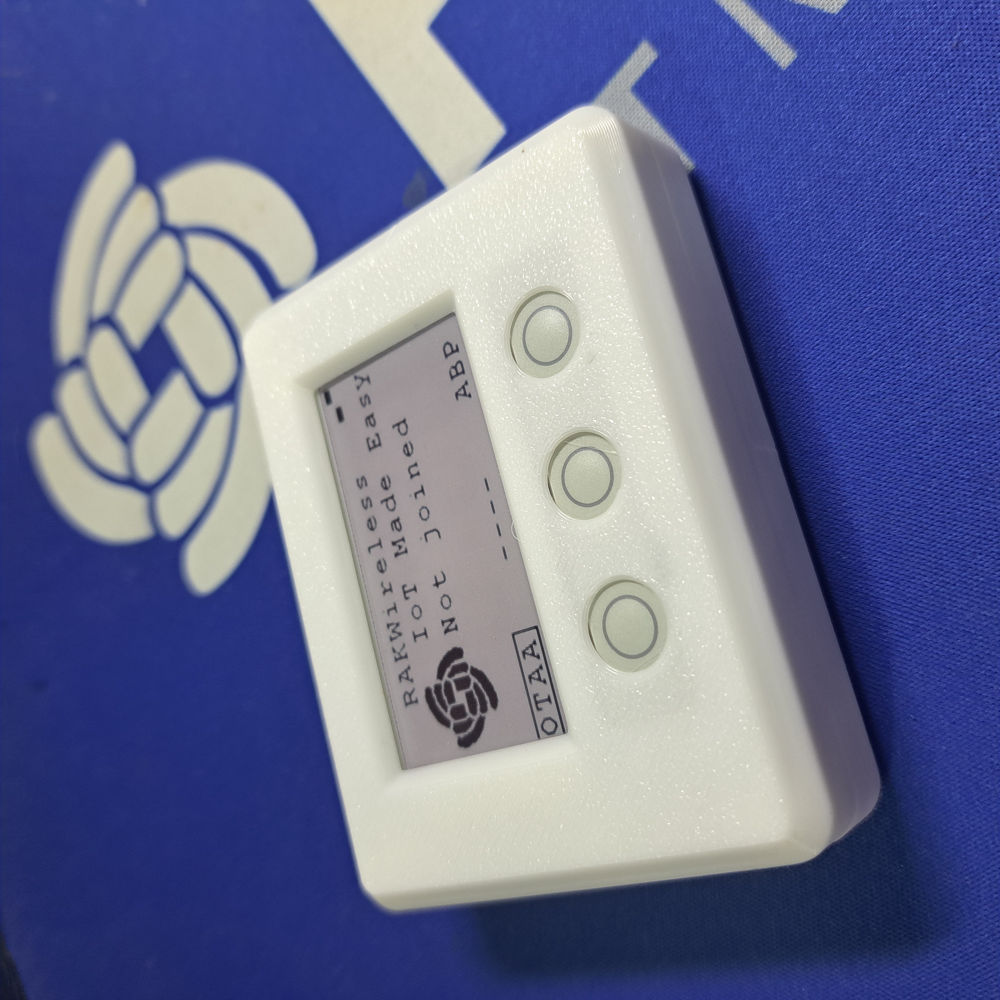

|  |  |  |    
| :-: | :-: | :-: |     

# RUI3-LoRaWAN-Demo 2.13" E-ink Display
RUI3 example code for WisBlock modules with a 2.13" E-ink display and buttons.

This example code is _**NOT**_ using the loop at all. Instead it is complete event driven. The WisDuo/WisBlock module is sleeping unless an event occurs. An event can be a timer callback or an external interrupt, or if using LoRaWAN Class C, it can be a packet received from the LoRaWAN server.    

This example is a very simple demo for LoRaWAN to use OTAA and ABP join procedures, display the status on a E-ink display and use the button to join and send packets.

  

3D printed enclosure sources can be found in [Makerworld](https://makerworld.com/en/models/1715606-rakwireless-enclosure-for-rak14000-epd-and-buttons#profileId-1820863)

The code compiles on all RUI3 modules.    

----

# Content
- [Hardware supported](#hardware_supported)
- [Software used](#software_used)
- [Packet data format](#packet_data_format)

# Hardware supported
| Module | Function | Supported |
| --     | --       | --          |
| [RAK4631-R](https://docs.rakwireless.com/Product-Categories/WisBlock/RAK4631-R/Overview/) ⤴️ | WisBlock Core module with RUI3| ✔ |
| [RAK3372](https://docs.rakwireless.com/Product-Categories/WisDuo/RAK3172-Evaluation-Board/Overview) ⤴️ | WisDuo RAK3172 Evaluation Board with RUI3| ✔ |
| [RAK19007](https://docs.rakwireless.com/Product-Categories/WisBlock/RAK19007/Overview/) ⤴️ | WisBlock Base board | ✔ |
| [RAK14000](https://docs.rakwireless.com/Product-Categories/WisBlock/RAK14000/Overview/) ⤴️ | WisBlock E-Ink display and buttons | ✔ |

----

# Software used
## IDE
- [ArduinoIDE](https://www.arduino.cc/en/software) ⤴️
- [RAK-STM32-RUI](https://github.com/RAKWireless/RAKwireless-Arduino-BSP-Index) ⤴️
- [RAK-nRF52-RUI](https://github.com/RAKWireless/RAKwireless-Arduino-BSP-Index) ⤴️
- [RAK-Apollo3-RUI](https://github.com/RAKWireless/RAKwireless-Arduino-BSP-Index) ⤴️
## LoRaWAN payload creation
- [CayenneLPP](https://github.com/ElectronicCats/CayenneLPP) ⤴️
- [ArduinoJson](https://github.com/bblanchon/ArduinoJson) ⤴️
## Display librarie
- [RAK14000 EPD](https://github.com/beegee-tokyo/RAKwireless_RAK14000_EPD_2_13) ⤴️

----

# How to use
After reset or power up, the device is in standby mode. The display will show _**Not Joined**_.     
To use the device, it has to be registered on a LoRaWAN server as OTAA device.     

The default startup setting is OTAA join mode.     
Push the OTAA button to join the network.
Use the SEND button to send a packet.

Once the device has joined the network, it is possible to switch the devices join mode to ABP. After switching to ABP mode, the device will use the App Session Key and Network Session Key it received during the OTAA join process to act as an ABP device.

