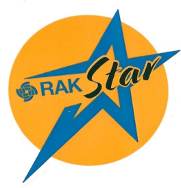

|  |  |  |    
| :-: | :-: | :-: |     

# Example for a simple RUI3 based location tracker

This code searches for an I2C or serial connected GNSS module based on u-blox MAX-7Q (RAK1910) or u-blox ZOE-M8Q (RAK12500).    
Then it starts a location acquisition in the time interval set with ATC+SENDINT. It will try to get a location in 1/2 the time of the acquisition time.     
If a location was aquired, it will send the location in Cayenne LPP format over LoRaWAN or LoRa P2P. If no location was found, it will send only the battery voltage.     

This library is tested with u-blox MAX-7Q (RAK1910) and u-blox ZOE-M8Q (RAK12500).
It uses Sparkfun libraries over I2C (RAK12500) or Serial (RAK1910) and UBX messages, which are shorter than NMEA messages and reduce the communication effort.    
For the u-blox MAX-7Q (RAK1910) an adapted version of the Sparkfun library is used.

### ⚠️ INFORMATION    
Depending on the satellites seen by the GNSS antenna, it can take up to 30 seconds to get a location. The send interval set with ATC+SENDINT should not be shorter than 1 minute.

### ⚠️ INFORMATION    
Due to the code size this example will only compile on the RAK3172 with one LoRaWAN region enabled. Otherwise it will throw an memory overflow error during compilation.

### Used libraries

[SparkFun_u-blox_GNSS_Arduino_Library](https://github.com/sparkfun/SparkFun_u-blox_GNSS_Arduino_Library) 
[MAX-7Q version of SparkFun_Ublox_Arduino_Library](https://github.com/sparkfun/SparkFun_Ublox_Arduino_Library/tree/master/examples/Series_6_7)

----

# Get RUI3 devices

Get a RAKwireless RUI3 WisDuo stamp module, breakout board or evaluation board from our [store](https://store.rakwireless.com/collections/new-menu-modules)

Get a RAKwireless RUI3 WisBlock Core module from our [store](https://store.rakwireless.com/collections/wisblock-core)

### ⚠️ INFORMATION 
Only the following modules are supported by RUI3:    

_**WisDuo**_
- RAK3172 stamp module, breakout board, evaluation board
- RAK3172-SiP chip, breakout board
- RAK4630 stamp module
- RAK11720 stamp module, breakout board    

_**WisBlock Core**_
- RAK4631-R
- RAK3372
- RAK11722

----

# LoRa® is a registered trademark or service mark of Semtech Corporation or its affiliates. 

----

# LoRaWAN® is a licensed mark.