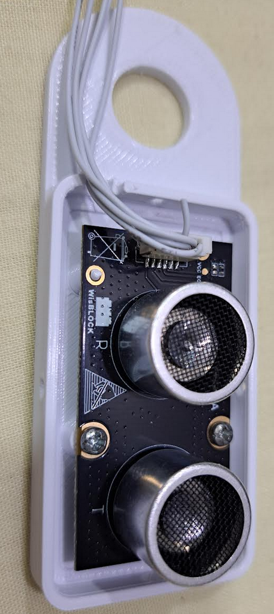
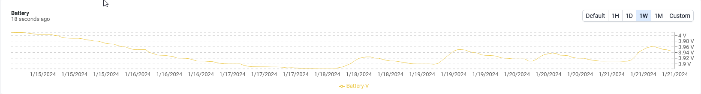
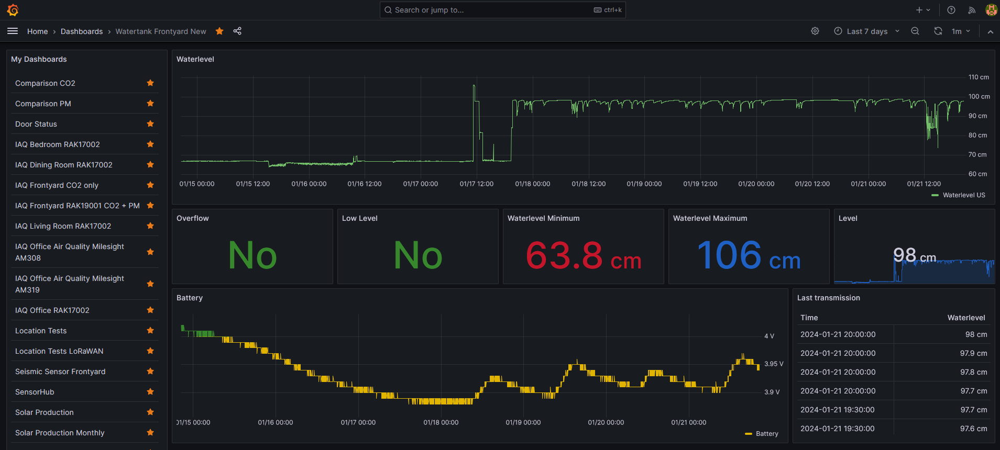

|  |  |  |    
| :-: | :-: | :-: |     

# Example how measure the water level in a tank using RUI3 and the RAK12007 ultrasonic sensor

This PoC is measuring the distance between the sensor and the water surface in a watertank. It calculate the water level based on a configurable tank height and sends the results together with a low level or overflow alarm flag over LoRaWAN or LoRa P2P. After that the system goes back to sleep automatically.    

### ⚠️ INFORMATION
The payload is in Cayenne LPP format with extended data types. A matching decoder can be found in the [RAKwireless_Standardized_Payload Github repo](https://github.com/RAKWireless/RAKwireless_Standardized_Payload/blob/main/RAKwireless_Standardized_Payload.js)

This examples includes three custom AT commands:     
- **`ATC+SENDINT`** to set the send interval time or heart beat time. If the device is not in motion it will send a payload with this interval. The time is set in seconds, e.g. **`AT+SENDINT=600`** sets the send interval to 600 seconds or 10 minutes.    
- **`ATC+STATUS`** to get some status information from the device.    
- **`DEPTH`** set/Get the tank depth in mm (50mm to 3000mm)    

## Device in action
A water tank sensor is setup in my houses water level (temporary installation, needs improvements). The sensor itself is installed inside the tank, the WisBlock unit is installed on top of the tank (temporary installation, needs improvements).

| <center></center> | <center></center> | <center></center> |
| --- | --- | --- |
| temporary installation, only clipped to the tank border | temporary installation, needs improvements | will be sealed after sensor assembly |

The sensor is powered by a battery and recharged during the day by a solar panel on the Unify Enclosure.

<center></center>

The sensor data is visualized in Grafana on my local installed system:

<center></center>

----

# Code sections

### ⚠️ INFORMATION    
The code snippets below are simplified. Check the provided source code for the full code.    

## LoRa/LoRaWAN callbacks

There are different system callbacks that are invoked on LoRa/LoRaWAN events.    

For LoRaWAN there are 3 callbacks for join, send and receive events.

LoRaWAN join event is called when a join request was successful or failed. If it fails, it is called after all retries are used up, not on each single retry. The callback has the parameter _**`int32_t status`**_. The status is based on low level LoRaMAC stack results, at the moment the only usuable check is whether the status is 0 ==> join success or <>0 ==> join failed. It is possible to restart the join request from this callback if the attempt failed before.    

```cpp
void joinCallback(int32_t status)
{
	if (status != 0)
	{
		MYLOG("JOIN-CB", "LoRaWan OTAA - join fail! \r\n");
	}
	else
	{
		MYLOG("JOIN-CB", "LoRaWan OTAA - joined! \r\n");
	}
}
```

LoRaWAN TX finished callback is an important callback. It tells you whether the transmission of a LoRaWAN packet is finished. It is important, because a TX finished event is waking up the device, and when using the loop() function, a sleep call should be issued _**AFTER**_ the TX finished event. The callback has the parameter _**`int32_t status`**_. The status is based on low level LoRaMAC stack results, at the moment the only usuable check is whether the status is 0 ==> send success or <>0 ==> send failed.

```cpp
void sendCallback(int32_t status)
{
	MYLOG("TX-CB", "TX status %d", status);
}
```

LoRaWAN RX callback is called when a data packet was received from the LoRaWAN server. The callback has as parameter a pointer to a structure with information about the received data and pointers to the payload and its length.    

```cpp
void receiveCallback(SERVICE_LORA_RECEIVE_T *data)
{
	MYLOG("RX-CB", "RX, port %d, DR %d, RSSI %d, SNR %d", data->Port, data->RxDatarate, data->Rssi, data->Snr);
}
```

LoRa P2P TX finished callback is an important callback. It tells you whether the transmission of a LoRa packet is finished. It is important, because a TX finished event is waking up the device, and when using the loop() function, a sleep call should be issued _**AFTER**_ the TX finished event. The callback has the no parameters, as LoRa P2P does not have any protocol that would allow to know if the sent packet was received by another node..

```cpp
void send_cb(void)
{
	MYLOG("TX-P2P-CB", "P2P TX finished");
}
```

LoRa P2P RX callback is called when a data packet was received from another LoRa node. The callback has as parameter a structure with information about the received data, the payload and its length.    

```cpp
void recv_cb(rui_lora_p2p_recv_t data)
{
	MYLOG("RX-P2P-CB", "P2P RX, RSSI %d, SNR %d", data.Rssi, data.Snr);
}
```

----

## setup() and loop()

**`setup()`** is used as known from Arduino sketches to setup the system. It is called once after reboot or power up.    
There are two important parts in the setup() code.

First it checks whether the system is working in LoRaWAN mode or as a LoRa P2P mode. Depending on this, the different callbacks are setup.

```cpp
	// Setup for LoRaWAN
	if (api.lorawan.nwm.get() == 1)
	{
		// Setup the callbacks for joined and send finished
		api.lorawan.registerRecvCallback(receiveCallback);
		api.lorawan.registerSendCallback(sendCallback);
		api.lorawan.registerJoinCallback(joinCallback);
	}
	else // Setup for LoRa P2P
	{
		api.lorawan.registerPRecvCallback(recv_cb);
		api.lorawan.registerPSendCallback(send_cb);
	}
```

Second a periodic timer is initialized to wake up the system in intervals to send a packet to the LoRaWAN server or other LoRa P2P nodes. The interval time is set with the variable **`custom_parameters.send_interval`**.

```cpp
	// Create a timer.
	api.system.timer.create(RAK_TIMER_0, sensor_handler, RAK_TIMER_PERIODIC);
	if (custom_parameters.send_interval != 0)
	{
		// Start a timer.
		api.system.timer.start(RAK_TIMER_0, custom_parameters.send_interval, NULL);
	}
```

The **`loop()`** function does nothing beside of killing itself, which prevents that it is called frequently from the underlaying RUI3 scheduler.

```cpp
void loop()
{
	api.system.scheduler.task.destroy();
}
```

## sensor_handler & send_packet

This functions are where the action is happening. 

**`sensor_handler`** is called by the timer. First, if in LoRaWAN mode, it checks whether the node has already joined the network. Then, in this example, it is calling the sensor read function _**`read_rak12007`**_, that adds the water level value and alarm flags to the payload.    
After the payload is ready, it calls **`send_packet`** to get the packet sent out.

```cpp
void sensor_handler(void *)
{
	MYLOG("UPLINK", "Start");
	digitalWrite(LED_BLUE, HIGH);

	if (api.lorawan.nwm.get() == 1)
	{ // Check if the node has joined the network
		if (!api.lorawan.njs.get())
		{
			MYLOG("UPLINK", "Not joined, skip sending");
			return;
		}
	}

	digitalWrite(WB_IO2, HIGH);

	// Reset payload
	g_solution_data.reset();

	// Create payload
	float batt_lvl = 0.0;
	for (int i = 0; i < 10; i++)
	{
		batt_lvl += api.system.bat.get();
	}
	batt_lvl = batt_lvl / 10.0;

	g_solution_data.addVoltage(LPP_CHANNEL_BATT, batt_lvl);

	// Get distance from US sensor
	if (has_rak12007)
	{
		read_rak12007(true);
	}

	digitalWrite(WB_IO2, LOW);

	// Send the packet
	send_packet();
}
```

**`send_packet`** is checking whether the node is in LoRaWAN or LoRa P2P mode and sends the created payload depending on the selected mode.

```cpp
void send_packet(void)
{
	// Check if it is LoRaWAN
	if (api.lorawan.nwm.get() == 1)
	{
		MYLOG("UPLINK", "Sending packet # %d", my_fcount);
		my_fcount++;
		// Send the packet
		if (api.lorawan.send(g_solution_data.getSize(), g_solution_data.getBuffer(), set_fPort, g_confirmed_mode, g_confirmed_retry))
		{
			MYLOG("UPLINK", "Packet enqueued, size %d", g_solution_data.getSize());
			tx_active = true;
		}
		else
		{
			MYLOG("UPLINK", "Send failed");
			tx_active = false;
		}
	}
	// It is P2P
	else
	{
		MYLOG("UPLINK", "Send packet with size %d over P2P", g_solution_data.getSize());

		digitalWrite(LED_BLUE, LOW);

		if (api.lorawan.psend(g_solution_data.getSize(), g_solution_data.getBuffer(), true))
		{
			MYLOG("UPLINK", "Packet enqueued");
		}
		else
		{
			MYLOG("UPLINK", "Send failed");
		}
	}
}
```

## Initialize the RAK12007 ultrasonic sensor
This call is setting up the control GPIO's for the sensor. Then it is checking if a RAK12007 sensor module is present by running a test measurement. During power up the sensor should have a target in front of it in a distance less than 3m.
```cpp
bool init_rak12007(void)
{
	// Initialize GPIO
	pinMode(ECHO, INPUT);  // Echo Pin of Ultrasonic Sensor is an Input
	pinMode(TRIG, OUTPUT); // Trigger Pin of Ultrasonic Sensor is an Output
	pinMode(PD, OUTPUT);   // power done control pin is an Output
	digitalWrite(TRIG, LOW);
	digitalWrite(PD, LOW); // Power up the sensor
	delay(500);
	has_rak12007 = read_rak12007(false);
	if (!has_rak12007)
	{
		MYLOG("US", "Timeout on first measurement, assuming no sensor");
	}
	digitalWrite(PD, HIGH); // Power down the sensor

	return has_rak12007;
}
```

## Read the sensor
This call is running a 10 distance measurements with the ultrasonic sensor RAK12007 and calculates an average distance. The water level is then calculated with the known water tank height. The water tank height must be set with the AT command _**`ATC+DEPTH`**_ in mm.    
In addition, the function estimates whether a tank overflow might be coming (distance to water surface less than 50mm) or if the tank is going to be drained (water level is less than 2/3rd of the water tank height). The water level and the alert flags are then added to the payload.    
To reduce the battery consumption, the ultrasonic sensor is only powered up during the measurement and is otherwise powered off.    

In case there is a problem of reading the distance values, the level is set to 0 and both overflow and low-level alarm flags are set in the payload.

```cpp
bool read_rak12007(bool add_payload)
{
	uint32_t respond_time;
	uint64_t measure_time = 0;
	uint32_t distance = 0;
	uint16_t valid_measures = 0;

	digitalWrite(PD, LOW); // Power up the sensor
	digitalWrite(TRIG, LOW);
	delay(500);

	// Do 10 measurements to get an average
	for (int reading = 0; reading < 10; reading++)
	{
		digitalWrite(TRIG, HIGH);
		delayMicroseconds(20); // pull high time need over 10us
		digitalWrite(TRIG, LOW);
		respond_time = pulseInLong(ECHO, HIGH, 2000000L); // microseconds
		delay(33);
		if ((respond_time > 0) && (respond_time < TIME_OUT)) // ECHO pin max timeout is 33000us according it's datasheet
		{
#ifdef _VARIANT_RAK4630_
			measure_time += respond_time * 0.7726; // Time calibration factor is 0.7726,to get real time microseconds for 4631 board
#else
			measure_time += respond_time; // No time calibration
#endif
			valid_measures++;
		}
		else
		{
			MYLOG("US", "Timeout");
		}
		MYLOG("US", "Respond time is %d valid measures %d", respond_time, valid_measures);
		delay(500);
	}
	measure_time = measure_time / valid_measures;

	if ((measure_time > 0) && (measure_time < TIME_OUT)) // ECHO pin max timeout is 33000us according it's datasheet
	{
		// Calculate measured distance
		distance = measure_time * ratio; // Test distance = (high level time × velocity of sound (340M/S) / 2
		bool overflow = false;
		bool low_level = false;
		// Check for low level
		if (distance > g_custom_parameters.tank_depth_mm / 3 * 2) // 2/3rd of tank depth
		{
			low_level = true;
		}
		// Check for overflow
		if (distance < 50)
		{
			overflow = true;
		}

		MYLOG("US", "Distance is %ld mm", distance);

		// Calculate level from measured Distance
		uint16_t level = g_custom_parameters.tank_depth_mm - distance;

		MYLOG("US", "Waterlevel is %ld mm", level);

		if (add_payload)
		{
			// Add level to the payload (in cm !)
			g_solution_data.addAnalogInput(LPP_CHANNEL_WLEVEL, (float)(level / 10.0));
			g_solution_data.addPresence(LPP_CHANNEL_WL_LOW, low_level);
			g_solution_data.addPresence(LPP_CHANNEL_WL_HIGH, overflow);
		}
		digitalWrite(PD, HIGH); // Power down the sensor
		digitalWrite(TRIG, HIGH);
		return true;
	}
	else
	{
		if (add_payload)
		{
			// Report an error with both overflow and low level alert set
			g_solution_data.addAnalogInput(LPP_CHANNEL_WLEVEL, 0.0);
			g_solution_data.addPresence(LPP_CHANNEL_WL_LOW, true);
			g_solution_data.addPresence(LPP_CHANNEL_WL_HIGH, true);
		}
	}
	digitalWrite(PD, HIGH); // Power down the sensor
	digitalWrite(TRIG, HIGH);
	return false;
}
```

----

# Get RUI3 devices

Get a RAKwireless RUI3 WisDuo stamp module, breakout board or evaluation board from our [store](https://store.rakwireless.com/collections/new-menu-modules)

Get a RAKwireless RUI3 WisBlock Core module from our [store](https://store.rakwireless.com/collections/wisblock-core)

### ⚠️ INFORMATION 
Only the following modules are supported by RUI3:    

_**WisDuo**_
- [RAK3172 stamp module](https://docs.rakwireless.com/Product-Categories/WisDuo/RAK3172-Module/Overview/)
- [RAK3272S breakout board](https://docs.rakwireless.com/Product-Categories/WisDuo/RAK3272S-Breakout-Board/Overview/)
- [RAK3172 evaluation board](https://docs.rakwireless.com/Product-Categories/WisDuo/RAK3172-Evaluation-Board/Overview/)
- [RAK3172-SiP chip](https://docs.rakwireless.com/Product-Categories/WisDuo/RAK3172-SiP/Overview/)
- [RAK3272-SiP breakout board](https://docs.rakwireless.com/Product-Categories/WisDuo/RAK3272-SiP-Breakout-Board/Overview/)
- [RAK4630 stamp module](https://docs.rakwireless.com/Product-Categories/WisDuo/RAK4630-Module/Overview/)
- [RAK11720 stamp module](https://docs.rakwireless.com/Product-Categories/WisDuo/RAK11720-Module/Overview/)    
- [RAK11721 breakout board](https://docs.rakwireless.com/Product-Categories/WisDuo/RAK11721-Breakout-Board/Overview/)    

_**WisBlock Core**_
- [RAK4631-R](https://docs.rakwireless.com/Product-Categories/WisBlock/RAK4631-R/Overview/)
- [RAK3372](https://docs.rakwireless.com/Product-Categories/WisBlock/RAK3372/Overview/)
- [RAK11722](https://docs.rakwireless.com/Product-Categories/WisBlock/RAK11722/Overview/)

----

# LoRa® is a registered trademark or service mark of Semtech Corporation or its affiliates. 

----

# LoRaWAN® is a licensed mark.