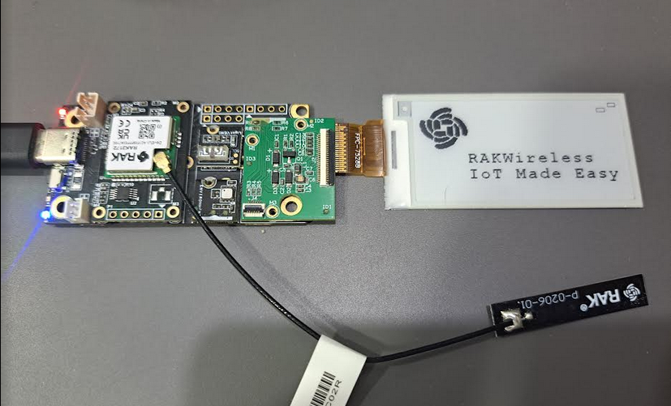
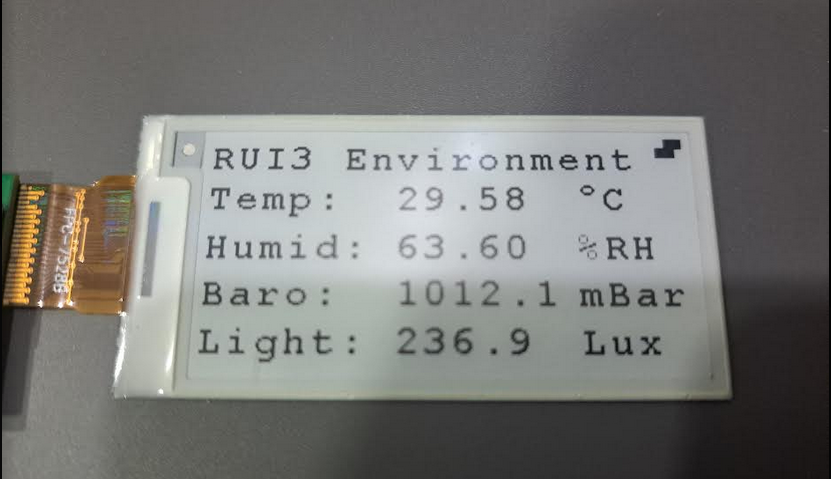

|  |  |  |    
| :-: | :-: | :-: |     

# RUI3-Sensor-Node-With 2.13" E-ink Display
RUI3 example code for WisBlock I2C sensor modules, focused on Environment and Light sensors and a 2.13" E-ink display.

This example code is _**NOT**_ using the loop at all. Instead it is complete event driven. The WisDuo/WisBlock module is sleeping unless an event occurs. An event can be a timer callback or an external interrupt, or if using LoRaWAN Class C, it can be a packet received from the LoRaWAN server.    

This code does setup a timer that wakes up the device in the desired send interval, send a packet and then the system goes back to sleep automatically.    
It can be extended to use external interrupts, see my other examples codes.

The code compiles on all RUI3 modules. But when used with a RAK3172, due to the limited memory available, only one LoRaWAN region can be enabled.     

This examples includes three custom AT commands:     
- **`ATC+SENDINT`** to set the send interval time or heart beat time. If the device is not in motion it will send a payload with this interval. The time is set in seconds, e.g. **`AT+SENDINT=600`** sets the send interval to 600 seconds or 10 minutes.    
- **`ATC+STATUS`** to get some status information from the device.    

Once the device has connected to a LoRaWAN server, it will update the display with the latest measurements and send a data packet to the server.    

|  |  |
| :-: | :-: |    
----

# Content
- [Hardware supported](#hardware_supported)
- [Software used](#software_used)
- [Packet data format](#packet_data_format)

# Hardware supported
| Module | Function | Supported |
| --     | --       | --          |
| [RAK4631-R](https://docs.rakwireless.com/Product-Categories/WisBlock/RAK4631-R/Overview/) ⤴️ | WisBlock Core module with RUI3| ✔ |
| [RAK3372](https://docs.rakwireless.com/Product-Categories/WisDuo/RAK3172-Evaluation-Board/Overview) ⤴️ | WisDuo RAK3172 Evaluation Board with RUI3| ✔ |
| [RAK19007](https://docs.rakwireless.com/Product-Categories/WisBlock/RAK19007/Overview/) ⤴️ | WisBlock Base board | ✔ |
| [RAK19001](https://docs.rakwireless.com/Product-Categories/WisBlock/RAK19001/Overview/) ⤴️ | WisBlock Fullsize Base board | ✔ |
| [RAK1906](https://docs.rakwireless.com/Product-Categories/WisBlock/RAK1906/Overview/) ⤴️ | WisBlock Environment Sensor | ✔ |
| [RAK1903](https://docs.rakwireless.com/Product-Categories/WisBlock/RAK1903/Overview/) ⤴️ | WisBlock Light sensor OPT3000 | ✔ |    
| [RAK12010](https://docs.rakwireless.com/Product-Categories/WisBlock/RAK12010/Overview/) ⤴️ | WisBlock Light sensor VEML7700 | ✔ |    

----

# Software used
## IDE
- [ArduinoIDE](https://www.arduino.cc/en/software) ⤴️
- [RAK-STM32-RUI](https://github.com/RAKWireless/RAKwireless-Arduino-BSP-Index) ⤴️
- [RAK-nRF52-RUI](https://github.com/RAKWireless/RAKwireless-Arduino-BSP-Index) ⤴️
- [RAK-Apollo3-RUI](https://github.com/RAKWireless/RAKwireless-Arduino-BSP-Index) ⤴️
## LoRaWAN payload creation
- [CayenneLPP](https://github.com/ElectronicCats/CayenneLPP) ⤴️
- [ArduinoJson](https://github.com/bblanchon/ArduinoJson) ⤴️
## Sensor libraries
- [RAK1906 Environment](https://downloads.rakwireless.com/RUI/RUI3/Library/RAKwireless_RAK1906_Environment_BME680.zip) (manual installation) ⤴️
- [RAK1903 Light](https://downloads.rakwireless.com/RUI/RUI3/Library/RAKwireless_RAK1903_Optical_OPT3001.zip) (manual installation) ⤴️
- [RAK12010 Light](https://github.com/RAKWireless/RAK12010-VEML7700-Library) ⤴️
- [RAK14000 EPD](https://github.com/beegee-tokyo/RAKwireless_RAK14000_EPD_2_13) ⤴️

----

# Packet data format
The packet data is made compatible with the extended Cayenne LPP encoding from [ElectronicCats/CayenneLPP](https://github.com/ElectronicCats/CayenneLPP) ⤴️.    
The content of the packet depends on the modules installed on the WisBlock Base Board:     

| Data                     | Channel # | Channel ID | Length   | Comment                                           | Required Module   | Decoded Field Name |
| --                       | --        | --         | --       | --                                                | --                | --                 |
| Battery value            | 1         | _**116**_  | 2 bytes  | 0.01 V Unsigned MSB                               | RAK4631           | voltage_1          |
| Humidity                 | 2         | 104        | 1 bytes  | in %RH                                            | RAK1901           | humidity_2         |
| Temperature              | 3         | 103        | 2 bytes  | in °C                                             | RAK1901           | temperature_3      | 
| Barometric Pressure      | 4         | 115        | 2 bytes  | in hPa (mBar)                                     | RAK1902           | barometer_4        |
| Illuminance              | 5         | 101        | 2 bytes  | 1 lux unsigned                                    | RAK1903           | illuminance_5      |
| Humidity 2               | 6         | 104        | 1 bytes  | in %RH                                            | RAK1906           | humidity_6         |
| Temperature 2            | 7         | 103        | 2 bytes  | in °C                                             | RAK1906           | temperature_7      | 
| Barometric Pressure 2    | 8         | 115        | 2 bytes  | in hPa (mBar)                                     | RAK1906           | barometer_8        |
| Gas Resistance 2         | 9         | 2          | 2 bytes  | 0.01 signed (kOhm)                                | RAK1906           | analog_9           |
| GNSS stand. resolution   | 10        | 136        | 9 bytes  | 3 byte lon/lat 0.0001 °, 3 bytes alt 0.01 meter   | RAK1910, RAK12500 | gps_10             |
| GNSS enhanced resolution | 10        | _**137**_  | 11 bytes | 4 byte lon/lat 0.000001 °, 3 bytes alt 0.01 meter | RAK1910, RAK12500 | gps_10             |
| Soil Temperature         | 11        | 103        | 2 bytes  | in °C                                             | RAK12023/RAK12035 | temperature_11     |
| Soil Humidity            | 12        | 104        | 1 bytes  | in %RH                                            | RAK12023/RAK12035 | humidity_12        |
| Soil Humidity Raw        | 13        | 2          | 2 bytes  | 0.01 signed                                       | RAK12023/RAK12035 | analog_in_13       |
| Soil Data Valid          | 14        | 102        | 1 bytes  | bool                                              | RAK12023/RAK12035 | presence_14        |
| Illuminance 2            | 15        | 101        | 2 bytes  | 1 lux unsigned                                    | RAK12010          | illuminance_15     |
| VOC                      | 16        | _**138**_  | 2 bytes  | VOC index                                         | RAK12047          | voc_16             |
| MQ2 Gas                  | 17        | 2          | 2 bytes  | 0.01 signed                                       | RAK12004          | analog_in_17       |
| MQ2 Gas Percentage       | 18        | _**120**_  | 1 bytes  | 1-100% unsigned                                   | RAK12004          | percentage_18      |
| MG812 Gas                | 19        | 2          | 2 bytes  | 0.01 signed                                       | RAK12008          | analog_in_19       |
| MG812 Gas Percentage     | 20        | _**120**_  | 1 bytes  | 1-100% unsigned                                   | RAK12008          | percentage_20      |
| MQ3 Alcohol Gas          | 21        | 2          | 2 bytes  | 0.01 signed                                       | RAK12009          | analog_in_21       |
| MQ3 Alcohol Gas Perc.    | 22        | _**120**_  | 1 bytes  | 1-100% unsigned                                   | RAK12009          | percentage_22      |
| ToF distance             | 23        | 2          | 2 bytes  | 0.01 signed                                       | RAK12014          | analog_in_23       |
| ToF Data Valid           | 24        | 102        | 1 bytes  | bool                                              | RAK12014          | presence_24        |
| Gyro triggered           | 25        | _**134**_  | 6 bytes  | 2 bytes per axis, 0.01 °/s                        | RAK12025          | gyrometer_25       |
| Gesture detected         | 26        | 0          | 1 byte   | 1 byte with id of gesture                         | RAK14008          | digital_in_26      |
| LTR390 UVI value         | 27        | 2          | 2 byte   | 0.01 signed                                       | RAK12019          | analog_in_27       | 
| LTR390 UVS value         | 28        | 101        | 2 bytes  | 1 lux unsigned                                    | RAK12019          | illuminance_28     | 
| INA219 Current           | 29        | 2          | 2 byte   | 0.01 signed                                       | RAK16000          | analog_29          | 
| INA219 Voltage           | 30        | 2          | 2 byte   | 0.01 signed                                       | RAK16000          | analog_30          | 
| INA219 Power             | 31        | 2          | 2 byte   | 0.01 signed                                       | RAK16000          | analog_31          | 
| Touchpad left            | 32        | 102        | 1 bytes  | bool                                              | RAK14002          | presence_32        | 
| Touchpad middle          | 33        | 102        | 1 bytes  | bool                                              | RAK14002          | presence_33        | 
| Touchpad right           | 34        | 102        | 1 bytes  | bool                                              | RAK14002          | presence_34        | 
| SCD30 CO2 concentration  | 35        | 125        | 2 bytes  | 1 ppm unsigned                                    | RAK12037          | 
| SCD30 temperature        | 36        | 103        | 2 bytes  | in °C                                             | RAK12037          | 
| SCD30 humidity           | 37        | 104        | 1 bytes  | in %RH                                            | RAK12037          | 
| MLX90632 sensor temp     | 38        | 103        | 2 bytes  | in °C                                             | RAK12003          |
| MLX90632 object temp     | 39        | 103        | 2 bytes  | in °C                                             | RAK12003          |

### _REMARK_
Channel ID's in cursive are extended format and not supported by standard Cayenne LPP data decoders.

A matching decoder can be found in the [RAKwireless_Standardized_Payload Github repo](https://github.com/RAKWireless/RAKwireless_Standardized_Payload/blob/main/RAKwireless_Standardized_Payload.js) ⤴️
