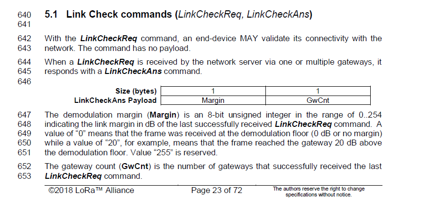
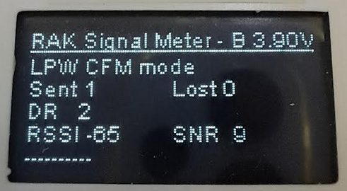
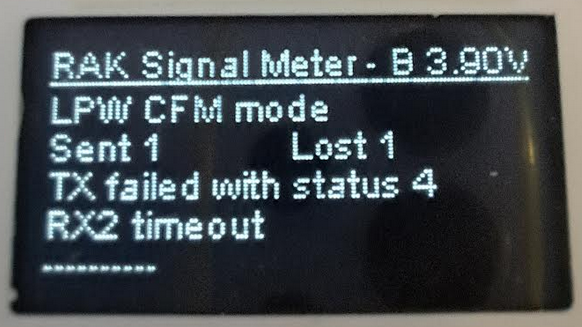

# Simple RUI3 based Signal Meter
|  |      |  |    
| :-: | :-: | :-: |

----

#### ⚠️ IMPORTANT ⚠️        
This firmware requires at least RUI3 V4.1.1_266 or newer.
RUI3 V4.1.1 is at the time of post only available as staging BSP version and is not published officially.
RUI3 staging versions can be installed to use the Arduino BSP JSON files that can be found in the [staging branch of the BSP repository](https://github.com/RAKWireless/RAKwireless-Arduino-BSP-Index/tree/staging/RUI_4.1.1_266) (Example link for staging version 4.1.1_266)

----

# Content
- [Overview](#overview)
- [Hardware](#hardware)
- [Enclosure](#enclosure)
- [Setup](#setup)
  - [LoRa P2P](#lora-p2p)
  - [LoRaWAN confirmed packets](#lorawan-confirmed-packets)
  - [LoRaWAN LinkCheck](#lorawan-linkcheck)
- [Firmware](#firmware)

----

# Overview

This is a PoC of a very basic signal tester. It works in both LoRa P2P and LoRaWAN mode. It uses a simple OLED display and has no GUI. All settings are done over USB with RUI3 AT commands.    
It is a very simple (~30 US$ cheap) device that can help to check LoRa and LoRaWAN coverage. It does not claim to be a super precise instrument, it is just an affordable small instrument to check signal coverage.    

#### ⚠️ INFO ⚠️        
One of the advantages of this simple tester is that it does not require any backend installations on the LoRaWAN server and is tested with Helium, TTN and Chirpstack, but should work with any LoRaWAN server like AWS or Actility.

## LoRa P2P mode
If used in LoRa P2P, it is just listening on the setup LoRa P2P settings:
- Frequency
- Bandwidth
- Spreading Factor
- Coding Rate
- Preample Length  

If a packet is received on above settings, it will display the information on the OLED screen.

## LoRaWAN mode
If used in LoRaWAN mode, the device is connecting to a LoRaWAN server and sends out frequently a data packet. 
It requires setup of the devices with its LoRaWAN credentials and register on a LoRaWAN server with
- DevEUI
- AppEUI
- AppKey
- OTAA join mode
- LoRaWAN region

It uses either confirmed packet mode or LinkCheck to collect information about the connection to the gateway(s).    
If used with confirmed packets, it will display the RSSI and SNR of the ACK packet received from the LoRaWAN server.    
If used with LinkCheck, the LoRaWAN server will report the number of gateways and the demodulation margin (calculated on the LoRaWAN server). The demodulation margin can give you information about the received signal quality.    
Extract from the _**LoRaWAN 1.0.3 Specification**_:
<center></center>

[Back to top](#content)

----

# Hardware
The device is built with WisBlock modules with only a little soldering required:
- [WisBlock Base Board RAK19003 (Mini Base Board)](https://store.rakwireless.com/products/wisblock-base-board-rak19003)
- [WisBlock Core Module RAK3372 (STM32WLE5)](https://store.rakwireless.com/products/wisblock-core-module-rak3372)
- [WisBlock RAK1921 OLED display](https://store.rakwireless.com/products/rak1921-oled-display-panel)

WisBlock modules itself do not require any soldering, only the connection for the RAK1921 OLED display to the WisBlock Base Board requires to solder some pin headers to be able to plug the display in.    

<center></center>

To extend lifetime of the device, the battery can be disconnected by a simple slider switch. This helps to avoid discharging the battery while the device is not in use. But to charge the battery, the device has to be switched on!

[Back to top](#content)

----

# Enclosure

The enclosure is 3D printed and kept as simple as possible. Three parts (if a lid for the USB access is required) are needed. The bottom and the lid are sliding into each other and secured with two screws.

<center></center>

As the OLED display is only hold by the pin headers, the enclosure implements three simple pilars as support.    

The slider switch requires no screwing or glueing, it is clipped into the bottom part of the enclosure.

<center></center>

If required, the USB access can be closed with a simple rotating lid.

<center></center>

The bottom and lid of the enclosure are secured with two M3 screws. To avoid worn out of the self-cut threads, the bottom part of the enclosure includes two small details to hold the M3 nuts. The M3 nuts are simply glued into these details.

<center></center>

Below the OLED display is space for a 500mAh battery to run the device outdoors.

#### ⚠️ TIP ⚠️        
The step files for the enclosure are available in this repository in the folder [enclosure](./enclosure) 

[Back to top](#content)

----

# Setup

## LoRa P2P

To use the device in LoRa P2P mode it has to be set into this mode with     
```at
AT+NWM=0
```
The device might reboot after this command, if it was not already in P2P mode.    
Then the LoRa P2P parameters have to be setup. In this example, I am setting the device to 916100000 Hz frequency, 125kHz bandwidth, spreading factor 7, coding rate 4/5, preamble length 8 and TX power of 5dBm:

```at
AT+PRECV=0
AT+P2P=916000000:7:0:1:8:5
```

#### ⚠️ TIP ⚠️ 
If the credentials were set already (they are saved in the flash of the device), the switch to P2P testing can as well be done with
```at
ATC+MODE=2
```
The device might reboot after this command, if it was not already in LoRa P2P mode.    


#### ⚠️ TIP ⚠️        
The command _**`AT+PRECV=0`**_ is _**required**_ to stop the device from listening. While in RX mode, parameters cannot be changed.

To be able to receive packets from other devices, they have to be setup to exactly the same parameters.

If the setup of all devices is the same, the display will show the received LoRa P2P packets:

- P2P received packet number
- Frequency, spreading factor and bandwidth
- RSSI
- SNR

<center></center>


[Back to top](#content)

----

## LoRaWAN confirmed packets

To use the device in LoRaWAN mode it has to be set into this mode with     
```at
AT+NWM=1
```
The device might reboot after this command, if it was not already in LoRaWAN mode.    
Then the LoRaWAN parameters and credentials have to be setup. In this example, I am setting the device to AS923-3, OTAA join mode, confirmed packet mode, disable link check and then reset the device to perform a LoRaWAN JOIN sequence:

```at
AT+BAND=10
AT+NJM=1
AT+CFM=1
AT+LINKCHECK=0
AT+DEVEUI=AC1F09FFFE000000
AT+APPEUI=AC1F09FFFE000000
AT+APPKEY=AC1F09FFFE000000AC1F09FFFE000000
ATZ
```

#### ⚠️ TIP ⚠️ 
If the credentials were set already (they are saved in the flash of the device), the switch to CFM testing can as well be done with
```at
ATC+MODE=1
```
The device might reboot after this command, if it was not already in LoRaWAN mode.    

#### ⚠️ IMPORTANT ⚠️        
The device has to be registered in a LoRaWAN server with these credentials and a gateway in range has to be connected to the LoRaWAN server. Otherwise the device cannot join and there are no tests possible!
If the device cannot join the network, it will show an error on the display:

<center></center>

In this case double check all settings on the device and LoRaWAN server and check if a gateway is in range and connected to the LoRaWAN server.

After the device has joined the network, it will send confirmed packets to the LoRaWAN server. The LoRaWAN server will send a downlink packet with the ACK. The display will show
- Packet number
- DR of the received packet
- RSSI of the received packet
- SNR of the received packet

<center></center>

If the device is out of the range of gateways (after it had joined before), it will show an error message if the LoRaWAN server did not send an ACK for the packet:

- Packet number
- Error message
- Error detail
- Number of lost packets

<center></center>

[Back to top](#content)

----

## LoRaWAN LinkCheck

To use the device in LoRaWAN mode it has to be set into this mode with     
```at
AT+NWM=1
```
The device might reboot after this command, if it was not already in LoRaWAN mode.    
Then the LoRaWAN parameters and credentials have to be setup. In this example, I am setting the device to AS923-3, OTAA join mode, unconfirmed packet mode, enable link check and then reset the device to perform a LoRaWAN JOIN sequence:

```at
AT+BAND=10
AT+NJM=1
AT+CFM=0
AT+LINKCHECK=2
AT+DEVEUI=AC1F09FFFE000000
AT+APPEUI=AC1F09FFFE000000
AT+APPKEY=AC1F09FFFE000000AC1F09FFFE000000
ATZ
```

#### ⚠️ TIP ⚠️ 
If the credentials were set already (they are saved in the flash of the device), the switch to LinkCheck testing can as well be done with
```at
ATC+MODE=0
```
The device might reboot after this command, if it was not already in LoRaWAN mode.    

#### ⚠️ IMPORTANT ⚠️        
The device has to be registered in a LoRaWAN server with these credentials and a gateway in range has to be connected to the LoRaWAN server. Otherwise the device cannot join and there are no tests possible!
If the device cannot join the network, it will show an error on the display:

<center></center>

In this case double check all settings on the device and LoRaWAN server and check if a gateway is in range and connected to the LoRaWAN server.

After the device has joined the network, it will send unconfirmed packets with LinkCheck request enabled to the LoRaWAN server. The LoRaWAN server will answer to the LinkCheck request. The display will show
- Linkcheck result
- Packet number and number of gateways
- DR of the received packet
- RSSI and SNR of the received packet
- Demodulation Margin from the LoRaWAN server

<center></center>

If the device is out of the range of gateways (after it had joined before), it will show an error message if the LoRaWAN server did respond to the LinkCheck request:
- Linkcheck result
- Number of lost packets

<center></center>

[Back to top](#content)

----

# Firmware

The firmware for this simple field tester is available in this repository.

Callbacks are defined for all possible events, both LoRa P2P and LoRaWAN and trigger the display to change its content.

The **`setup()`**` function is checking in which mode the device is setup and initializes the required event callbacks.

The application is complete timer triggered and the **`loop()`** function is not used.

## LoRa P2P callbacks

```cpp
/**
 * @brief Receive callback for LoRa P2P mode
 *
 * @param data structure with RX packet information
 */
void recv_cb_p2p(rui_lora_p2p_recv_t data)
{}
```

## LoRaWAN callback

```cpp
/**
 * @brief Join network callback
 * 
 * @param status status of join request
 */
void join_cb_lpw(int32_t status)
{}

/**
 * @brief Receive callback for LoRaWAN mode
 *
 * @param data structure with RX packet information
 */
void recv_cb_lpw(SERVICE_LORA_RECEIVE_T *data)
{}

/**
 * @brief Send finished callback for LoRaWAN mode
 *
 * @param status
 */
void send_cb_lpw(int32_t status)
{}

/**
 * @brief Linkcheck callback
 * 
 * @param data structure with the result of the Linkcheck
 */
void linkcheck_cb_lpw(SERVICE_LORA_LINKCHECK_T *data)
{}
```

## LoRaWAN send
This function sends a short LoRaWAN packet in confirmed or unconfirmed mode, depending whether LinkCheck is enabled or not
```cpp
/**
 * @brief Send a LoRaWAN packet
 *
 * @param data unused
 */
void send_packet(void *data)
{
	Serial.println("Send packet");
	uint8_t payload[4] = {0x01, 0x02, 0x03, 0x04};
	if (use_link_check)
	{
		// Linkcheck is enabled, send an unconfirmed packet
		api.lorawan.send(4, payload, 2, false);
	}
	else
	{
		// Linkcheck is disabled, send a confirmed packet
		api.lorawan.send(4, payload, 2, true, 8);
	}
}
```

## Display handler
The display handler callback includes a flag that tells what kind of display content should be displayed.
```cpp
/**
 * @brief Display handler
 *
 * @param reason 1 = RX packet display
 *               2 = TX failed display (only LPW mode)
 *               3 = Join failed (only LPW mode)
 *               4 = Linkcheck result display (only LPW LinkCheck mode)
 */
void handle_display(void *reason)
{}

```
[Back to top](#content)

----

----
----

# LoRa® is a registered trademark or service mark of Semtech Corporation or its affiliates. 


# LoRaWAN® is a licensed mark.

----
----