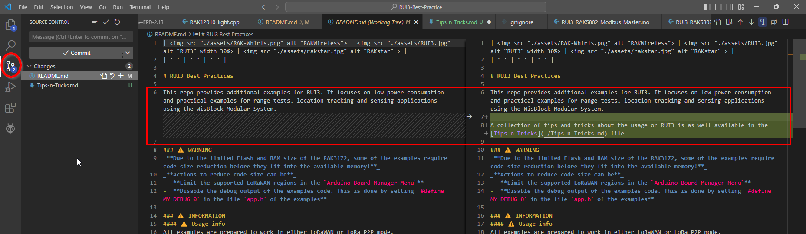
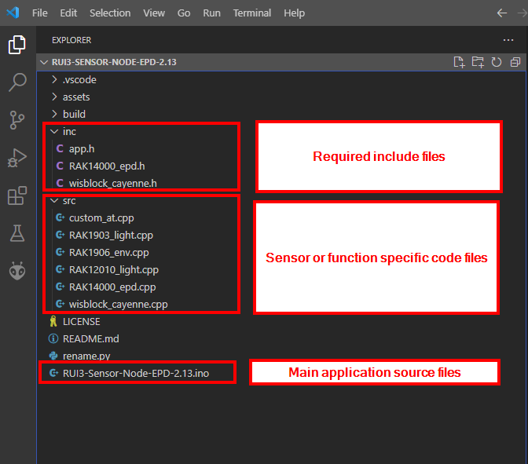
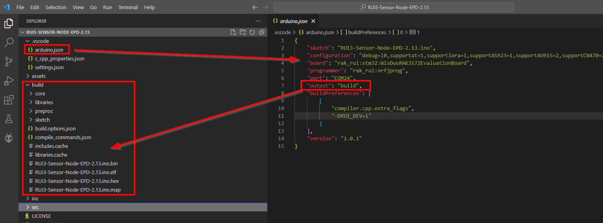
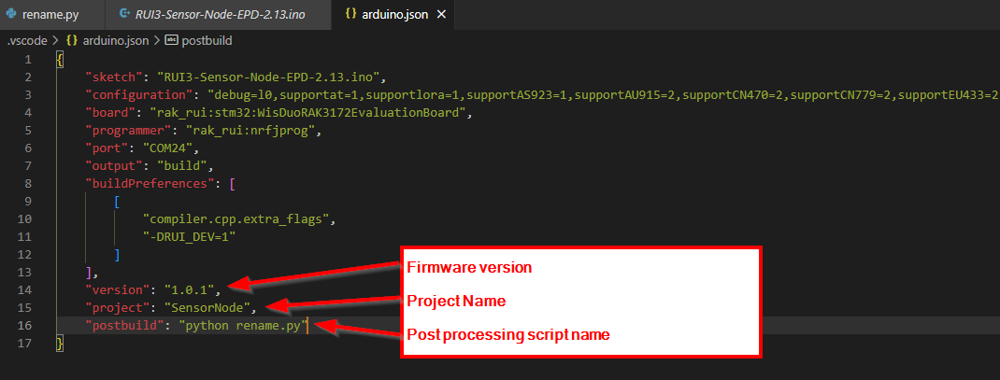
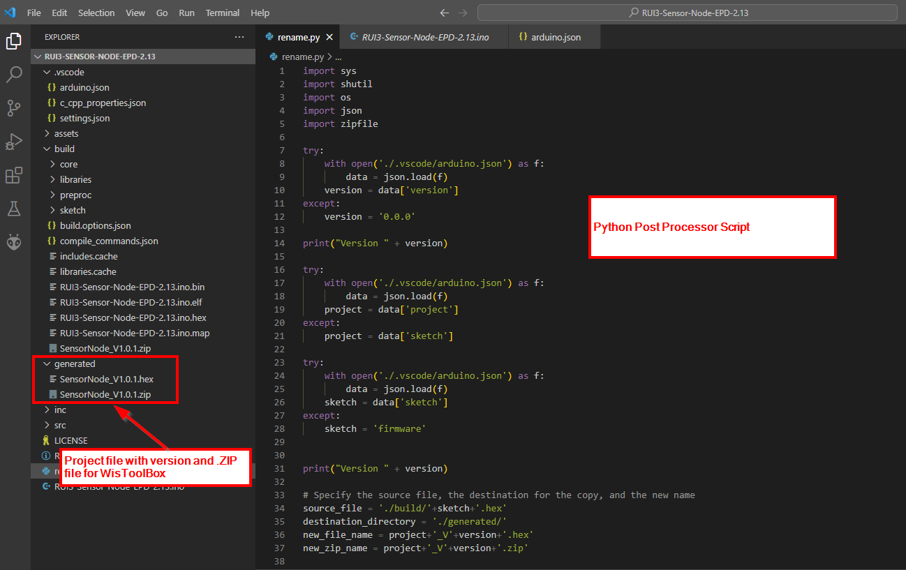
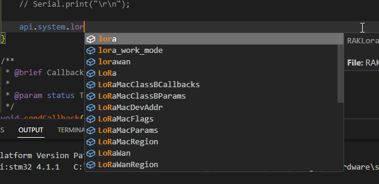
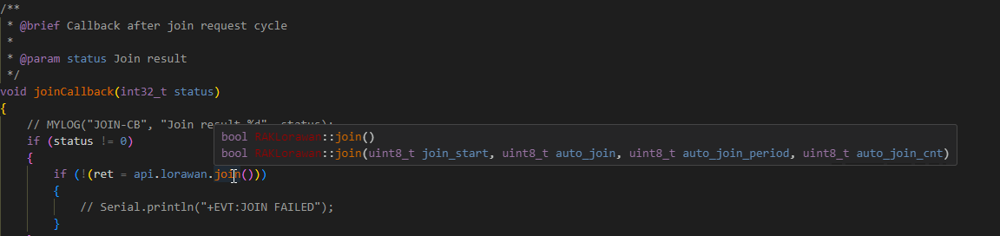
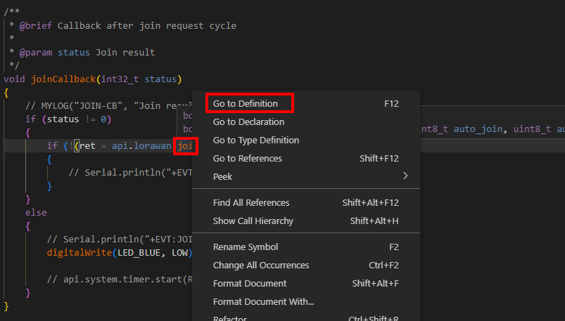
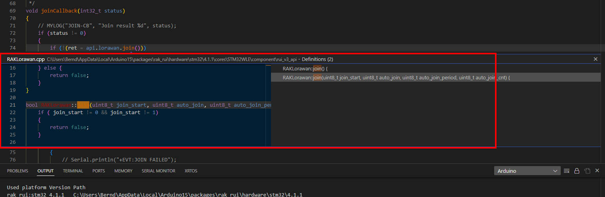
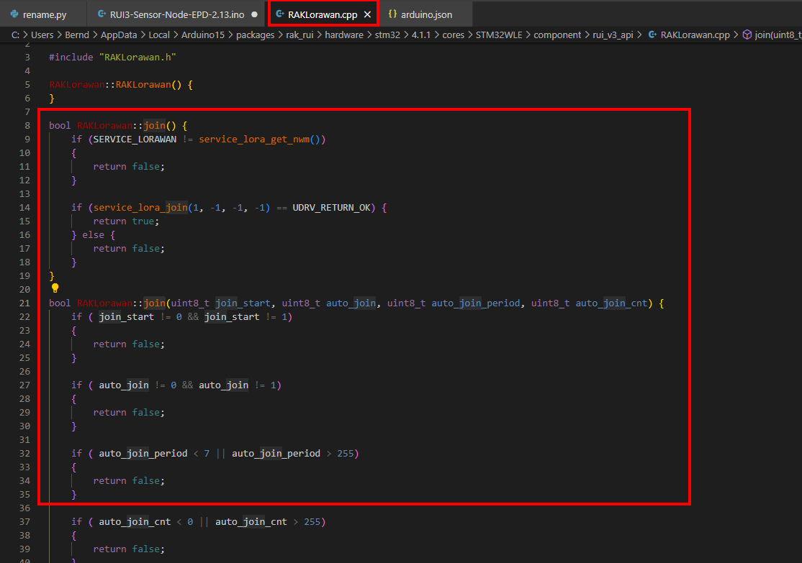

|  |  |  |    
| :-: | :-: | :-: |     

# Tips and Tricks when using RUI3

#### About this tips and tricks:    
When starting to write applications with RUI3, there are a few things that are not obvious to new users or developers coming from other platforms. RUI3 has some mighty features that makes it easy to write applications for LoRaWAN or LoRa P2P end nodes, but it is missing some "comfort" features that other BSP's with FreeRTOS based environments are giving.    

But what makes RUI3 easy to use for LoRaWAN and LoRa P2P end nodes, is that the complete handling of the communication is already integrated and sending and receiving data, connecting to LoRaWAN servers is possible with a few API functions and the callbacks that RUI3 provides.    

#### Background:    
I am writing CoP's and applications since 2014 using the Arduino IDE. The BSP's of the MCU's I am used to are all based on the FreeRTOS multitasking operating system.    
So I got pampered with the comfort of tasks, timers, semaphores and queues to handle the workflow in my applications.    

In RUI3 there are no tasks, no semaphores, no queues, so there is some re-thinking required.    

With the _**RUI3 Best Practice**_ examples I want to share how I am using RUI3. And this _**Tips and Tricks**_ is more insight of the hidden gems of RUI3 and how to utilize them in applications.    

#### ⚠️ Important note about RUI3 version compatibility 
These tips and tricks require at least RUI3 V4.1.1 or newer.
At the time this document was published, RUI3 V4.1.1 was still in staging. It can be installed by using the Arduino BSP JSON file for the staging version by using  _**`https://raw.githubusercontent.com/RAKWireless/RAKwireless-Arduino-BSP-Index/staging/RUI_4.1.1_266/package_rakwireless_com_rui_index.json`**_ in the **`Additional Boards Manager URLs`** settings in ArduinoIDE.     
Installation guides for Arduino IDE and Visual Studio Code can be found in the [RAK Documentation Center](https://docs.rakwireless.com/RUI3/Supported-IDE/).

## Content

- [Advantages when using Visual Studio Code](#advantages-when-using-visual-studio-code)
- [How to setup RUI3 for LoRaWAN communication](#how-to-setup-rui3-for-lorawan-communication)
   - [LoRaWAN example](#lorawan-example)
- [How to setup RUI3 for LoRa P2P communication](#how-to-setup-rui3-for-lora-p2p-communication)
   - [LoRaP2P example](#lorawan-example)
- [RUI3 event callbacks explained](#rui3-event-callbacks-explained)
- [Using RUI3 timers](#using-rui3-timers)
- [Wake up on external interrupts](#wake-up-on-external-interrupts)
- [Building a low power application based on timers and events](#building-a-low-power-application-based-on-timers-and-events)


----

## Advantages when using Visual Studio Code

This is not only for RUI3, IMHO using Visual Studio Code has many advantages over the ArduinoIDE. Here I only want to show some of the comfort features that ArduinoIDE is missing.    
Of course some things seem to be more complicated, but when writing applications that are longer than a few hundred lines of code, the handling of a project is much easier with Visual Studio Code.

### (1) Source control
With VSC it is much easier to handle code versioning with the integration of GIT. With GIT you can push and pull from and to code repositories in the cloud, may it be GitHub, GitLab, BitBucket or others.     
Keep different versions of the source codes separated. Pushing the project to repositories in the cloud make sure your code is not lost in case your local computer gets into problems.     
It is as well easy to share code and libraries with others, if you are active in the open-source community.    

See and check your changes, commit them and push them to your repository from VSC Source Control:


### (2) Code structuring
Once many sensors, timer functions, interfaces are used within a project, putting everything into a single source code file (or sketch, how it is called in ArduinoIDE) makes the code difficult to understand and maintain.    
With VSC you can split your code into meaningful files and includes in sub paths. You can give the code files names that makes it easy to understand what they are doing.    

In this example I separated the sensor handler files and the include files into separate folders:    


### (3) Keep the compiled files within the project folder
With a simple setting in the _**`.vscode/arduino.json`**_ file you keep the results of the compilation (.hex, .bin, .elf, ...) within the project folder instead of searching for them in a random folder in the computer users folder.

Setup output path in _**`.vscode/arduino.json`**_


### (4) Add version numbers to the generated flashable file
With another setting in the _**`.vscode/arduino.json`**_ file you can add the firmware version to the file name and keep the latest generated firmware in a separate folder.    
If you are using WisToolBox to flash your firmware, you can as well create automatically the required ZIP file from your flashable file.

Setup version number, project name and post-processing script in _**`.vscode/arduino.json`**_    


Get the ready to use files in the _**generated**_ folder:
    

An example for the post processing script is in the RUI3-Sensor-Node-EPD-2.13-VSC project ==> [rename.py](./RUI3-Sensor-Node-EPD-2.13-VSC/rename.py)    

### (5) Use the VSC prediction and helper features when writing code    
When starting to write a function call, VSC will help with a prediction of the possible function names:    
    

Not sure what parameters an API (or library function call) requires. Simply hovering over the function shows the required and optional parameters:


Need to know how the API (or library function call) code looks like?         
Right click on the function call and select _**Go to Definition**_    


Jump to the desired version of the function call with a double click    


The source file with the function code will open. This works whether the file is within the BSP or within a library.    
    

[Back to Content](#content)

----

## How to setup RUI3 for LoRaWAN communication
If you are looking into the example codes, you will find only a subset of the required settings to connect a node. The reason for this is that IMHO these parameters should be setup with AT commands. This makes it easier in mass-production flashing to assign unique parameters to each device.    
However, for testing or home use all LoRaWAN parameters can be setup with API calls.    
In the following paragraphs you can find the essential parameters required to join a LoRaWAN network.    

### Set the device into LoRaWAN mode    
Before any LoRaWAN parameter can be set, the device has to switch to LoRaWAN mode. The selected mode is, as all other parameters, saved in the flash memory and reused on the next power up.

```cpp
api.lorawan.nwm.set(1); // Set the device into LoRaWAN mode
```
INFO ⚠️    
If the device was in LoRa P2P mode, it will reboot after this API call.

### LoRaWAN credentials for OTAA join process    
OTAA device activation means that the device is registered in the LoRaWAN server with its OTAA credentials. During the join process, the LNS checks the credentials and sends back the root keys to the device for the data communication. This method is considered safer, as the encryption keys are generated during the join process.

LoRaWAN join mode, required to initialize the device to use OTAA join method. If the parameter is 1, OTAA is used, if 0, ABP is used.    
```cpp
api.lorawan.njm.set(1); // Set LoRaWAN join mode OTAA
```

DevEUI, an array of 8 bytes giving the device a unique identifier.
```cpp
uint8_t this_dev_eui = {0x01, 0x02, 0x03, 0x04, 0x05, 0x06, 0x07, 0x08};
api.lorawan.deui.set(this_dev_eui, 8);
```

AppEUI, an array of 8 bytes with the unique application or join identifier. Required by the LoRaWAN server.    
```cpp
uint8_t this_app_eui = {0x01, 0x02, 0x03, 0x04, 0x05, 0x06, 0x07, 0x08};
api.lorawan.appeui.set(this_app_eui, 8);
```

AppKey, an array of 16 bytes that is used as encryption key during the join procedure. Required by the LoRaWAN server.    
```cpp
uint8_t this_app_key = {0x01, 0x02, 0x03, 0x04, 0x05, 0x06, 0x07, 0x08, 0x01, 0x02, 0x03, 0x04, 0x05, 0x06, 0x07, 0x08};
api.lorawan.appkey.set(this_app_key, 16);
```

### LoRaWAN credentials for ABP join process    
ABP device activation means that both the end node and the LoRaWAN server have preset root keys for the device communication. This method is considered less safe, as the root keys are stored in the end node. The advantages of the ABP activation are    

- Join process not necessary. 
- As the root keys are stored in the end node, even on a power cycle or reset of the device, the device can immediately send data without the need to go through the join process.

_**!!! But the device still has to call the join function to setup the connection internally !!!**_

LoRaWAN join mode, required to initialize the device to use OTAA join method. If the parameter is 1, OTAA is used, if 0, ABP is used.    
```cpp
api.lorawan.njm.set(0); // Set LoRaWAN join mode ABP
```

Device address, an array of 4 bytes giving the device a unique address.
```cpp
uint8_t this_dev_addr = {0x01, 0x02, 0x03, 0x04};
api.lorawan.daddr.set(this_dev_addr, 4);
```

AppsKey, an array of 16 bytes with the root key for the application. Required by the LoRaWAN server.    
```cpp
uint8_t this_apps_key = {0x01, 0x02, 0x03, 0x04, 0x05, 0x06, 0x07, 0x08, 0x01, 0x02, 0x03, 0x04, 0x05, 0x06, 0x07, 0x08};
api.lorawan.appskey.set(this_apps_key, 16);
```

NWsKey, an array of 16 bytes with the root key for the network session. Required by the LoRaWAN server.    
```cpp
uint8_t this_nws_key = {0x01, 0x02, 0x03, 0x04, 0x05, 0x06, 0x07, 0x08, 0x01, 0x02, 0x03, 0x04, 0x05, 0x06, 0x07, 0x08};
api.lorawan.nwkskey.set(this_nws_key, 16);
```

### LoRaWAN regional parameters
As different countries are using different ISM frequencies, the LoRa Alliance has defined different LoRaWAN regions with parameters that make sure that the LoRa communication is within the legal limits of the region. The device has to be setup for the correct LoRaWAN region to be able to connect to the network.    
LoRaWAN end devices usually support 8 different channels (frequencies). Some LoRaWAN regions offer more than these 8 channels, e.g. US915. In this case the device has to be setup to the correct sub band channels.    

Setup of the LoRaWAN region. Valid parameters are 
| id  | Region  | id  | Region  | id  | Region  | id  | Region  |
| :-: | ------- | :-: | ------- | :-: | ------- | :-: | ------- |
| 0   | EU433   | 1   | CN470   | 2   | RU864   | 3   | IN865   |
| 4   | EU868   | 5   | US915   | 6   | AU915   | 7   | KR920   |
| 8   | AS923-1 | 9   | AS923-2 | 10  | AS923-3 | 11  | AS923-4 |
| 12  | LA915   |     |         |     |         |     |         |   

```cpp
api.lorawan.band.set(4); // Set region to EU868
```

Set the sub band, if required, e.g. US915. Valid settings are        
| Sub Band | Channels US915 | Channels AU915 | Channels LA915 | Channels CN470 |
| :------: | :------------: | :------------: | :------------: | :------------: |
| ALL 	   | All Channels   | All Channels   | All Channels   | All Channels   | 
| 1 	   | 0-7, 64        | 	0-7, 64      | 	0-7, 64       | 0-7            |
| 2 	   | 8-15, 65       | 	8-15, 65     | 8-15, 65       | 8-15           |
| 3   	   | 16-23, 66      | 	16-23, 66    |	16-23, 66     | 16-23          |
| 4 	   | 24-31, 67      | 	24-31, 67    |	24-31, 67     | 24-31          | 
| 5 	   | 32-39, 68      | 	32-39, 68    |	32-39, 68     | 32-39          | 
| 6 	   | 40-47, 69      | 	40-47, 69    |	40-47, 69     | 40-47          | 
| 7 	   | 48-55, 70      | 	48-55, 70    |	48-55, 70     | 48-55          |
| 8 	   | 56-63, 71      | 	56-63, 71    |	56-63, 71     | 56-63          |
| 9 	   | -              | 	-            | 		-         | 64-71          |
| 10 	   | -              | 	-            | 	-             |	72-79          |
| 11 	   | -              | 	-            | 	-             |	80-87          |
| 12 	   | -              | 	-            |	-             | 88-95          | 

```cpp
uint16_t maskBuff = 0x0001; // Subband #1 for TTN in US915
api.lorawan.mask.set(&maskBuff);
```

### LoRaWAN datarate and transmit power
The LoRaWAN datarate is a combination of spreading factor and bandwidth and pre-defined for the LoRaWAN regions. There are theoretically 16 datarates available. But many regions support only a subset of them. You can find an overview of the regional datarates in the [RAKwireless RUI3 Data Rate by Region](https://docs.rakwireless.com/RUI3/Appendix/#data-rate-by-region). The datarate defines as well the maximum payload size of a transmitted packet. You can find an overview of the packet size per datarate and region in the [RAKwireless RUI3 Maximum Transmission Load by Region](https://docs.rakwireless.com/RUI3/Appendix/#maximum-transmission-load-by-region).

```cpp
api.lorawan.dr.set(5); // Set datarate to 5
```
The LoRaWAN specification defines the transmit power in 16 steps, with 0 being the highest transmit power and 15 being the lowest. The transmit power is different for each LoRaWAN region to stay within the legal limits. An overview of the TX power can be found in [RAKwireless RUI3 TX Power by Region](https://docs.rakwireless.com/RUI3/Appendix/#tx-power-by-region).

```cpp
api.lorawan.txp.set(1); // Set TX power to 1
```

### LoRaWAN join
Before a device can send data to a LoRaWAN server, it has to successfully join the network. This can be done in OTAA or ABP mode.    
A LoRaWAN join request is only needed once after a power up or restart.    

(1) Function definition with parameters:
```cpp
bool RAKLorawan::join(uint8_t join_start, uint8_t auto_join, uint8_t auto_join_period, uint8_t auto_join_cnt);
```
The parameters are:
- join_start - start the join request
- auto_join - set auto join. If set to true, after the next power up or reset, the device will automatically start the join request. If set to false, the join request has to be started manually every time.
- auto_join_period - the time in seconds between join request retries
- auto_join_cnt -  the number of retries before the join requests are stopped if they fail

```cpp
api.lorawan.join(1,1,10,30); // Start Join request, set auto join, time between retries = 10 seconds, retry 30 times to join
```

(2) Function definition without parameters:
```cpp
bool RAKLorawan::join(void);
```
In this case the join request will be started with the settings that were pre-defined with AT commands and read back from flash settings.

```cpp
api.lorawan.join();
```

### LoRaWAN send packet
To be able to send a data packet over LoRaWAN, the device has to be connected to the network first.    
Function definition:
```cpp
api.lorawan.send(length, payload, fport, confirm, retry);
```
The parameters are:
- length - the length of the payload REQUIRED
- payload - the data to uplink REQUIRED
- fport - allow 1 ~ 223 REQUIRED
- confirm - Override cfm setting to get confirm message from gateway (just for this time) 
   - _**OPTIONAL, IF OMITTED THE SAVED CONFIRM MODE IS USED**_
- retry - Override retry setting to retry if sending failed (just for this time) 
   - _**OPTIONAL, IF OMITTED THE SAVED RETRY SETTING IS USED**_

```cpp
uint8_t payload[] = "example";
api.lorawan.send(sizeof(payload), payload, 2, true, 1);
```

### LoRaWAN receive packet
To be able to receive and process data from the LoRaWAN server, the LoRaWAN receive callback has to be implemented. See more details in [RUI3 event callbacks explained](#rui3-event-callbacks-explained)    

[Back to Content](#content)

---

## LoRaWAN example
Putting the minimum set of API calls together for a LoRaWAN join request and try to join the network.

### OTAA Join request
```cpp
api.lorawan.nwm.set(1); // Set the device into LoRaWAN mode
api.lorawan.njm.set(1); // Set LoRaWAN join mode OTAA
uint8_t this_dev_eui = {0x01, 0x02, 0x03, 0x04, 0x05, 0x06, 0x07, 0x08};
api.lorawan.deui.set(this_dev_eui, 8);
uint8_t this_app_eui = {0x01, 0x02, 0x03, 0x04, 0x05, 0x06, 0x07, 0x08};
api.lorawan.appeui.set(this_app_eui, 8);
uint8_t this_app_key = {0x01, 0x02, 0x03, 0x04, 0x05, 0x06, 0x07, 0x08, 0x01, 0x02, 0x03, 0x04, 0x05, 0x06, 0x07, 0x08};
api.lorawan.appkey.set(this_app_key, 16);
api.lorawan.band.set(5); // Set region to US915
// Next line is only required if US915, AU915, LA915 or CN470 region is used
uint16_t maskBuff = 0x0001; // Subband #1 for TTN in US915
api.lorawan.mask.set(&maskBuff);
api.lorawan.dr.set(5); // Set datarate to 5
api.lorawan.txp.set(1); // Set TX power to 1
api.lorawan.join();

// Wait for LoRaWAN join success

// Send a packet
uint8_t payload[] = "example";
api.lorawan.send(sizeof(payload), payload, 2, true, 1);
```

### ABP Join request
```cpp
api.lorawan.nwm.set(1); // Set the device into LoRaWAN mode
api.lorawan.njm.set(0); // Set LoRaWAN join mode ABP
uint8_t this_dev_addr = {0x01, 0x02, 0x03, 0x04};
api.lorawan.daddr.set(this_dev_addr, 4);
uint8_t this_apps_key = {0x01, 0x02, 0x03, 0x04, 0x05, 0x06, 0x07, 0x08, 0x01, 0x02, 0x03, 0x04, 0x05, 0x06, 0x07, 0x08};
api.lorawan.appskey.set(this_apps_key, 16);
uint8_t this_nws_key = {0x01, 0x02, 0x03, 0x04, 0x05, 0x06, 0x07, 0x08, 0x01, 0x02, 0x03, 0x04, 0x05, 0x06, 0x07, 0x08};
api.lorawan.nwkskey.set(this_nws_key, 16);
api.lorawan.band.set(5); // Set region to US915
// Next line is only required if US915, AU915, LA915 or CN470 region is used
uint16_t maskBuff = 0x0001; // Subband #1 for TTN in US915
api.lorawan.mask.set(&maskBuff);
api.lorawan.dr.set(5); // Set datarate to 5
api.lorawan.txp.set(1); // Set TX power to 1
api.lorawan.join();

// Wait for LoRaWAN join success

// Send a packet
uint8_t payload[] = "example";
api.lorawan.send(sizeof(payload), payload, 2, true, 1);
```

[Back to Content](#content)

----

## How to setup RUI3 for LoRa P2P communication
If you are looking into the example codes, you will find only a subset of the required settings to use a node in LoRa P2P mode. The reason for this is that IMHO these parameters should be setup with AT commands. This makes it easier in mass-production flashing to assign unique settings to each device.    
However, for testing or home use all LoRa P2P parameters can be setup with API calls.    
In the following paragraphs you can find the essential parameters required to start communciation with LoRa P2P.

INFO ⚠️     
To be able to communicate between two LoRa nodes with LoRa P2P, both nodes have to be setup with identical parameters. Otherwise they cannot receive any data packet.

### Set the device into LoRaP2P mode    
Before any LoRa P2P parameter can be set, the device has to switch to LoRa P2P mode. The selected mode is, as all other parameters, saved in the flash memory and reused on the next power up.

```cpp
api.lorawan.nwm.set(1); // Set the device into LoRa P2P mode
```
INFO ⚠️    
If the device was in LoRaWAN mode, it will reboot after this API call.

### Set LoRa frequency
Set the frequency for the communication in Hz. Make sure the selected frequency is within the supported range of the device.

```cpp
api.lorawan.pfreq.set(868000000); // Set the LoRa frequency to 868 MHz
```

### Set LoRa spreading factor
The spreading factor can be set to values between 6 and 12.   

```cpp
api.lorawan.psf.set(12); // Set LoRa SF to 12
```

### Set LoRa bandwidth
The bandwidth can be set to these values:
| Setting | Bandwidth in kHz | Setting | Bandwidth in kHz |      
| :-----: | ---------------- | :-----: | ---------------- |
| 0       | 125              | 1       | 250              |
| 2       | 500              | 3       | 7.8              |
| 4       | 10.4             | 5       | 15.63            |
| 6       | 20.83            | 7       | 31.25            |
| 8       | 41.67            | 9       | 62.5             |

```cpp
api.lorawan.psf.set(12); // Set LoRa SF to 12
```

### Set LoRa coding rate
The coding rate can be set to these values:
| Setting | Coding Rate | Setting | Coding Rate |      
| :-----: | ----------- | :-----: | ----------- |
| 0       | 4/5         | 1       | 4/6         |
| 2       | 4/7         | 3       | 4/8         |

```cpp
api.lorawan.pcr.set(0); // Set LoRa CR to 0 == 4/5
```

### Set LoRa preamble length
The preamble length can be set to values between 2 and 65535. However only small preamble lengths make sense.    

```cpp
api.lorawan.ppl.set(8); // Set LoRa preamble length to 8
```

### Set LoRa transmit power
The transmit power can be set to values between 5 dBm and 22dBm.    

```cpp
api.lorawan.ptp.set(22); // Set LoRa transmit power to 22dBm
```

### LoRa P2P send packet
To be able to send a data packet over LoRa P2P, the device has to be setup to P2P mode first.    
RUI3 supports CAD (Channel Activitiy Detection). If this option is enabled in the send call, the device will first check if any other device is currently sending on the same frequency. The packet will only be sent if no other device is occupying the frequency.    
The result of CAD is returned in a callback. See more details in [RUI3 event callbacks explained](#rui3-event-callbacks-explained)

Function definition:
```cpp
api.lorawan.psend(length, payload, ena_cad);
```
The parameters are:
- length - the length of the payload
- payload - the data send to the other device
- ena_cad - enable (TRUE) or disable (FALSE) CAD before sending

```cpp
uint8_t payload[] = "example";
api.lora.send(sizeof(payload), payload, true);
```

### LoRa P2P receive packet
To be able to receive and process data from other LoRa P2P nodes, the LoRa transceiver has to be set into RX (listen) mode. There are multiple options for the RX mode:

| Value | RX function |
| :---: | ----------- |
| 0     | RX off      |
| 1 ... 65532 | RX active for 1 to 65532 seconds, then it times out |
| 65533 | Permanent RX mode with the option to send a packet at any time |
| 65534 | Permanent RX mode, TX is not possible until RX mode is stopped |
| 65535 | Start RX mode until a packet was received, TX is not possible until RX mode is stopped |

Permanent RX mode means that the device continues to listen to incoming packets after it has received a packet.    

To be able to process data from another LoRa P2P device, the LoRa P2P receive callback has to be implemented. See more details in [RUI3 event callbacks explained](#rui3-event-callbacks-explained)     

```cpp
api.lorawan.precv(65533); // Start RX mode with the option to send a packet
```
[Back to Content](#content)

----

## LoRaP2P example
Putting the minimum set of API calls together for a LoRa P2P node, ready to receive and send packets to another LoRa P2P node.

```cpp
api.lorawan.nwm.set(1);
api.lorawan.pfreq.set(868000000); // Set the LoRa frequency to 868 MHz
api.lorawan.psf.set(12); // Set LoRa SF to 12
api.lorawan.pcr.set(0); // Set LoRa CR to 0 == 4/5
api.lorawan.ppl.set(8); // Set LoRa preamble length to 8
api.lorawan.ptp.set(22); // Set LoRa transmit power to 22dBm

api.lorawan.precv(65533); // Start RX mode with the option to send a packet

// Send a data packet
uint8_t payload[] = "example";
api.lora.send(sizeof(payload), payload, true);
```

[Back to Content](#content)

----

## RUI3 event callbacks explained
In RUI3 all LoRa/LoRaWAN functions (LoRaWAN/LoRa P2P RX, LoRaWAN/LoRa P2P TX, LoRaWAN join, LoRaWAN Linkcheck, LoRa P2P CAD result) are none-blocking. The API calls return to the application code immediately.    

Success or failure of a function is reported with callbacks. RUI3 defines 4 callbacks for LoRaWAN and 3 callbacks for LoRa P2P. As these callbacks are initiated by low-level functions in the LoRa drivers/LoRaMAC stack, the callbacks should not perform long lasting code, doing so might disturb the proper work of the low-level functions.    

In my examples I am using a timer function to start a handler for the callback. Another option would be to set a flag and handle it in the loop(). But this method would require to have the loop running all the time and check for the flag. This would be not the best solution for a low power application.    

### LoRaWAN Join callback
The LoRaWAN join callback informs the application about the success or failure of a Join process. In case the join request was setup for multiple retries, the join callback is called after the last unsuccessful retry.     

The Join callback is registered with 
```cpp
bool registerJoinCallback(service_lora_join_cb callback) 
```

The callback function has to be defined:
```cpp
void join_cb_lpw(int32_t status)
{
	if (status != 0)
	{
		Serial.println("Join request failed");
	}
	else
	{
		Serial.println("Join network successful");
	}
}
```

And then the callback can be registered
```cpp
api.lorawan.registerJoinCallback(join_cb_lpw);
```

### LoRaWAN transmission finished
The LoRaWAN transmission finished callback informs the application about the success or failure of the packet transmission.    
In the case the packet transmission was set to unconfirmed mode, the result will be always successful. In unconfirmed mode, the LoRaWAN node cannot know whether the LoRaWAN server has actually received the packet.

The TX finished callback is registered with 
```cpp
bool registerSendCallback(service_lora_send_cb callback)
```

The callback function has to be defined:
```cpp
void send_cb_lpw(int32_t status)
{
	Serial.printf("Transmission finished with status %d",status);
}
```

The `status` is RAK_LORAMAC_STATUS_OK if no error was detected when sending the packet. `status` can have the following values:
```cpp
typedef enum RAKLoRaMacEventInfoStatus
{
    RAK_LORAMAC_STATUS_OK = 0,                          ///Service performed successfully
    RAK_LORAMAC_STATUS_ERROR,                           ///An error occurred during the execution of the service
    RAK_LORAMAC_STATUS_TX_TIMEOUT,                      ///A Tx timeout occurred
    RAK_LORAMAC_STATUS_RX1_TIMEOUT,                     ///An Rx timeout occurred on receive window 1
    RAK_LORAMAC_STATUS_RX2_TIMEOUT,                     ///An Rx timeout occurred on receive window 2
    RAK_LORAMAC_STATUS_RX1_ERROR,                       ///An Rx error occurred on receive window 1
    RAK_LORAMAC_STATUS_RX2_ERROR,                       ///An Rx error occurred on receive window 2
    RAK_LORAMAC_STATUS_JOIN_FAIL,                       ///An error occurred in the join procedure
    RAK_LORAMAC_STATUS_DOWNLINK_REPEATED,               ///A frame with an invalid downlink counter was received. The downlink counter of the frame was equal to the local copy of the downlink counter of the node.
    RAK_LORAMAC_STATUS_TX_DR_PAYLOAD_SIZE_ERROR,        ///The MAC could not retransmit a frame since the MAC decreased the datarate. The payload size is not applicable for the datarate.
    RAK_LORAMAC_STATUS_DOWNLINK_TOO_MANY_FRAMES_LOSS,   ///The node has lost MAX_FCNT_GAP or more frames.
    RAK_LORAMAC_STATUS_ADDRESS_FAIL,                    ///An address error occurred
    RAK_LORAMAC_STATUS_MIC_FAIL,                        ///Message integrity check failure
    RAK_LORAMAC_STATUS_MULTICAST_FAIL,                  ///Multicast error occurred
    RAK_LORAMAC_STATUS_BEACON_LOCKED,                   ///Beacon locked
    RAK_LORAMAC_STATUS_BEACON_LOST,                     ///Beacon lost
    RAK_LORAMAC_STATUS_BEACON_NOT_FOUND,                ///Beacon not found
}RAKLoRaMacEventInfoStatus_t;
```

If confirmed mode is used, RAK_LORAMAC_STATUS_RX2_TIMEOUT indicates that the ACK from the LoRaWAN server was not received. 

And then the callback can be registered
```cpp
api.lorawan.registerSendCallback(send_cb_lpw);
```

### LoRaWAN data received
The LoRaWAN data received callback informs the application about the successful receive of a data packet from the LoRaWAN server.    

The data received callback is registered with 
```cpp
bool registerRecvCallback(service_lora_recv_cb callback)
```

The callback function has to be defined:
```cpp
void recv_cb_lpw(SERVICE_LORA_RECEIVE_T *data)
{
	MYLOG("RX-CB", "RX, port %d, DR %d, RSSI %d, SNR %d", data->Port, data->RxDatarate, data->Rssi, data->Snr);
}
```
The parameter data points to a structure with the received data and other information. The structure:
```cpp
    typedef struct SERVICE_LORA_RECEIVE
    {
        /*! Application port */
        uint8_t Port;
        /*! Downlink datarate */
        uint8_t RxDatarate;
        /*! Pointer to the received data stream */
        uint8_t *Buffer;
        /*! Size of the received data stream */
        uint8_t BufferSize;
        /*! Rssi of the received packet */
        int16_t Rssi;
        /*! Snr of the received packet */
        int8_t Snr;
        /*! The downlink counter value for the received frame */
        uint32_t DownLinkCounter;
    } SERVICE_LORA_RECEIVE_T;
```

And then the callback can be registered
```cpp
api.lorawan.registerSendCallback(send_cb_lpw);
```

### LoRaWAN Linkcheck callback
The LoRaWAN protocol implements methods to check whether the connection to the LoRaWAN server is working.    
One method is confirmed packets, which asks the LoRaWAN server to send an `ACK` back to the node after it received the packet. But this method does not deliver any information about the connection quality.    
The second method is Linkcheck. When Linkcheck is enabled, the LoRaWAN server will send back a packet with information about the connection quality.    

The Linkcheck callback is registered with 
```cpp
bool registerLinkCheckCallback(service_lora_linkcheck_cb callback)
```

The callback function has to be defined:
```cpp
void linkcheck_cb_lpw(SERVICE_LORA_LINKCHECK_T *data)
{
	Serial.printf("SNR (rcvd) %d\n",data->Snr);
	Serial.printf("RSSI (rcvd) %d\n",data->Rssi);
	Serial.printf("Linkcheck result %d\n",data->State); // 1 = valid data, 0 = no answer to LinkCheck request
	Serial.printf("Demodulation margin (rcvd) %d\n",data->DemodMargin);
	Serial.printf("Number of gateways %d\n",data->NbGateways);
}
```
The parameter data points to a structure with the Linkcheck information. The structure:
```cpp
    typedef struct SERVICE_LORA_LINKCHECK
    {
        uint8_t State;
        uint8_t DemodMargin;
        uint8_t NbGateways;
        int16_t Rssi;
        int8_t Snr;
    } SERVICE_LORA_LINKCHECK_T;
```

And then the callback can be registered
```cpp
api.lorawan.registerLinkCheckCallback(linkcheck_cb_lpw);
```

To enable LinkCheck an API call is required.
```cpp
uint8_t set_linkcheck = 2; // 0 = disable, 1 = Linkcheck once on the next transmission, 2 = Linkcheck on every transmission
api.lorawan.linkcheck.set(2); // Request Linkcheck on every transmission
```

### LoRa P2P transmission finished
The LoRa P2P transmission finished callback signals that a LoRa P2P transmission is finished. It does not return any information. It can be used to know when the LoRa transceiver is ready for the next data transmission.

The P2P transmission finished is registered with 
```cpp
bool registerPSendCallback(service_lora_p2p_send_cb_type callback)
```

The callback function has to be defined:
```cpp
void send_cb(void)
{
	Serial.println("P2P TX finished");
}
```

And then the callback can be registered
```cpp
api.lorawan.registerPSendCallback(send_cb);
```

### LoRa P2P data received
The LoRa P2P data received callback signals that a LoRa P2P packet was received. It delivers a structure with information about the received packet and the content of the packet itself.    

The P2P data received callback is registered with 
```cpp
bool registerPRecvCallback(service_lora_p2p_recv_cb_type callback)
```

The callback function has to be defined:
```cpp
void recv_cb(rui_lora_p2p_recv_t data)
{
	MYLOG("RX-P2P-CB", "P2P RX, RSSI %d, SNR %d", data.Rssi, data.Snr);
	for (int i = 0; i < data.BufferSize; i++)
	{
		Serial.printf("%02X", data.Buffer[i]);
	}
	Serial.print("\r\n");
}
```

And then the callback can be registered
```cpp
api.lorawan.registerPRecvCallback(recv_cb);
```

### LoRa P2P CAD finished callback
The LoRa P2P CAD finished callback returns the result of the CAD (channel activity detection).
If channel activity was detected, the LoRa P2P packet was not sent and should be rescheduled for sending.    

The P2P CAD finished callback is registered with 
```cpp
bool registerPSendCADCallback(service_lora_p2p_send_CAD_cb_type callback) 
```

The callback function has to be defined:
```cpp
void cad_cb(bool result)
{
	MYLOG("CAD-P2P-CB", "P2P CAD reports %s", result ? "activity" : "no activity");
}
```
The parameter `result` is true if activity was detected, false if no activity was detected

And then the callback can be registered
```cpp
api.lorawan.registerPSendCADCallback(cad_cb);
```

[Back to Content](#content)

----

## Using RUI3 timers
In the example codes provided, you can see that the RUI3 timers are often used for different tasks.    
(1) Trigger a recurring event, e.g. sending sensor data or a heart beat in a defined time interval    
(2) Used as one shot timers to start a handler for received data    
(3) For a not very well documented feature of the RUI3 timers to start a timer callback with a flag.    

Here it is shown how to implement the (3) usage of timers.    

Timers need to be initialized before they can be used. The function declaration is:
```cpp
timer::create(RAK_TIMER_ID id, RAK_TIMER_HANDLER handler, RAK_TIMER_MODE mode)
```
- id is the timer number, in RUI3 RAK_TIMER_0 to RAK_TIMER_4 are available for the application code.
- handler is the function to be called when the timer has expired
- mode is defining how the timer is triggered. There are two options:
   - RAK_TIMER_ONESHOT, this timer is only triggered one time
   - RAK_TIMER_PERIODIC, this timer is triggered periodically


When the timer is started, it expects beside of the timer id and the time a third parameter:
```cpp
timer::start(RAK_TIMER_ID id, uint32_t ms, void *data)
```
- id is the timer number, in RUI3 RAK_TIMER_0 to RAK_TIMER_4 are available for the application code.
- ms is the time in milliseconds
- data is the pointer to a variable. The variable is defined as void *, so it can point to any type of variable, an integer, a float or even to a data structure or array of variables.

In a simple usage of the timers, the third parameter is usually unused, like when a periodic event is triggered by the timer, as in this example, taken from the Modbus Master code:
```cpp
void modbus_read_register(void *)
{
	Serial.println("Send read request over ModBus");

	// Read data from a modbus slave
	// .........
	
	// Send the packet
	send_packet();
}

void setup()
{
	// The usual setup() stuff
	// .........

	uint32_t send_interval = 60000; // Set the send interval to 60 seconds

	// Create a timer for interval reading of sensor from Modbus slave.
	api.system.timer.create(RAK_TIMER_0, modbus_read_register, RAK_TIMER_PERIODIC);
	// Start a timer.
	api.system.timer.start(RAK_TIMER_0, send_interval, NULL);
}
```
This will just trigger the timer callback every 60 seconds, read some data and send it over LoRaWAN or LoRa P2P.

----
----

### ⚠️ !!!WARNING, BELOW USAGE OF THE TIMER HAS TO BE PLANNED WITH CAUTION. IF A TIMER IS STARTED WHILE THE TIMER CALLBACK IS STILL ACTIVE, THE SYSTEM WILL MOSTLIKELY CRASH. THE EXAMPLE CODE IS WORKING BECAUSE NONE OF THE EVENTS CAN HAPPEN AT THE SAME TIME AND THE TIMER CALLBACK IS KEPT AS SHORT AS POSSIBLE.

----
----

But due to the fact that data handling that takes a longer time should not be done within LoRa P2P callbacks, LoRaWAN callbacks or hardware interrupt callbacks, I implemented a method to use a timer to trigger a data handlers from these events.    

In this little example I will show how to trigger a handler function from different events using the void * data in the timer start call.    

The example is a reduced code taken from the RUI3-Signal-Meter-P2P-LPWAN example. The timer callback handler is updating a display and the data shown on the display is depending on the content of the void * data pointer.    
Multiple events can start the same timer and each event is putting a different value into a variable. A pointer to this variable is then added to the start function of the timer.    
Depending on the value of the variable, the timer callback handler is then showing different information on the display.

First the variable is defined as a global.    
```cpp
/** Flag for display handler */
uint8_t display_reason;
```
In the display handler, the variable is used to show the different content.
```cpp
/**
 * @brief Display handler
 *
 * @param reason 1 = RX packet display
 *               2 = TX failed display (only LPW mode)
 *               3 = Join failed (only LPW mode)
 *               4 = Linkcheck result display (only LPW LinkCheck mode)
 *               5 = Join success (only LPW mode)
 */
void handle_display(void *reason)
{
	// Get the wakeup reason
	uint8_t *disp_reason = (uint8_t *)reason;

	// Check if we have a reason, in this example there should be always a value
	if (disp_reason == NULL)
	{
		Serial.println("Bug in code!");
	}
	else if (disp_reason[0] == 1)
	{
		// Show the result of a received LoRaWAN or LoRa P2P packet
		// ................
	}
	else if (disp_reason[0] == 2)
	{
		// Show the result of a failed LoRaWAN transmission in confirmed mode (ACK not received)
		// ................
	}
	else if (disp_reason[0] == 3)
	{
		// Show the result of a failed LoRaWAN join request
		// ................
	}
	else if (disp_reason[0] == 5)
	{
		// Show the result of a successful Join request
		// ................
	}
	else if (disp_reason[0] == 4)
	{
		// Show the result of a Linkcheck request
		// ................
	}
}
```

In the different LoRa event callbacks the disp_reason is assigned a different value
```cpp
/**
 * @brief Join network callback
 *
 * @param status status of join request
 */
void join_cb_lpw(int32_t status)
{
	if (status != 0)
	{
		display_reason = 3;
		api.system.timer.start(RAK_TIMER_1, 250, &display_reason);
	}
	else
	{
		display_reason = 5;
		api.system.timer.start(RAK_TIMER_1, 250, &display_reason);
	}
}

/**
 * @brief Receive callback for LoRa P2P mode
 *
 * @param data structure with RX packet information
 */
void recv_cb_p2p(rui_lora_p2p_recv_t data)
{
	display_reason = 1;
	api.system.timer.start(RAK_TIMER_1, 250, &display_reason);
}

/**
 * @brief Receive callback for LoRaWAN mode
 *
 * @param data structure with RX packet information
 */
void recv_cb_lpw(SERVICE_LORA_RECEIVE_T *data)
{
	display_reason = 1;
	api.system.timer.start(RAK_TIMER_1, 250, &display_reason);
}

/**
 * @brief Send finished callback for LoRaWAN mode
 *
 * @param status
 */
void send_cb_lpw(int32_t status)
{
	if (status != RAK_LORAMAC_STATUS_OK)
	{
		display_reason = 2;
		api.system.timer.start(RAK_TIMER_1, 250, &display_reason);
	}
}

/**
 * @brief Linkcheck callback
 *
 * @param data structure with the result of the Linkcheck
 */
void linkcheck_cb_lpw(SERVICE_LORA_LINKCHECK_T *data)
{
	display_reason = 4;
	api.system.timer.start(RAK_TIMER_1, 250, &display_reason);
}
```

In `setup()` the RAK_TIMER_1 is setup as a one shot timer with `handle_display` as its callback.    
```cpp
void setup(void)
{
	// The usual setup() stuff
	// .........


	api.system.timer.create(RAK_TIMER_1, handle_display, RAK_TIMER_ONESHOT);
}
```

[Back to Content](#content)

----

## Wake up on external interrupts
If external interrupts, e.g. from a accelerometer are used to wake up the RUI3 device, the interrupt handler should be kept small, similar to the LoRa/LoRaWAN callbacks.     
Debug output should be complete avoided or kept to a minimum (better to complete avoid them!).    

Assigning an external interrupt to an interrupt handler is done by using the `attachInterrupt()` call.    
The interrupt handler itself has to be declared as `void handler(void)`.    
Example for a simple interrupt handler for an acceleration sensor:
```cpp
volatile bool motion_detected = false;

void int_callback_rak1904(void)
{
	motion_detected = true;
	// Wake the handler and start location acquisition
	api.system.timer.start(RAK_TIMER_2, 100, NULL);
}

void sensor_handler(void *)
{
	// Just for debug, show if the call is because of a motion detection
	if (motion_detected)
	{
		Serial.println("ACC triggered IRQ");
		motion_detected = false;

		// Do something based on the motion detection
		// .................
	}

	// If it was motion triggered, reset the ACC interrupts
	clear_int_rak1904();
}

void setup(void)
{
	Serial.println("Create timer for interrupt handler");
	// Create a timer
	api.system.timer.create(RAK_TIMER_2, sensor_handler, RAK_TIMER_ONESHOT);
	// Set the interrupt callback function
	// MYLOG("ACC", "Int pin %s", acc_int_pin == WB_IO3 ? "WB_IO3" : "WB_IO5");
	attachInterrupt(acc_int_pin, int_callback_rak1904, RISING);
}
```

As you can see, same as for the LoRa/LoRaWAN events, the interrupt handler is only setting a flag and waking another function with a one shot timer call to handle the interrupt. This avoids to spend too much time inside the interrupt handler.    
In this example, the interrupt handler is just setting a flag, then using a timer to call the `sensor_handler` where the motion event is handled.     

The [RUI3-RAK13011-Alarm](./RUI3-RAK13011-Alarm) example is handling another interrupt scenario. This examples is using an external interrupt from a reed relay to react on opening/closing of a door or a window and sending the status over LoRaWAN. Sending a packet over LoRaWAN can take several seconds, while the opening/closing interrupts can come much more frequent.    
To avoid loosing open/close events, the example is using a queue to store the events, while the events are sent one by one over LoRaWAN.    
In addition it implements a simple de-bounce of the reed relay contacts, using a timer for this as well.    

The events are handled in the function `handle_rak13011`, which is directly started from the timer callback. However, if the handler is still busy (it will run until the event queue is empty), the call to the handler is omitted and the event is pulled from the queue at a later time.

Switch interrupt and debouncing code:     
```cpp
volatile int switch_status = 0;

volatile bool handler_available = true;

void switch_int_handler(void)
{
	MYLOG("REED", "Interrupt, start bounce check");
	switch_status = digitalRead(SW_INT_PIN);
	api.system.timer.start(RAK_TIMER_2, 50, NULL);
}

void switch_bounce_check(void *)
{
	MYLOG("REED", "Bounce check");
	int new_switch_status = digitalRead(SW_INT_PIN);
	if (new_switch_status != switch_status)
	{
		MYLOG("REED", "Bounce detected");
		return;
	}
	if (switch_status == LOW)
	{
		// Push the new event into the queue
		if (!Fifo.enQueue(false))
		{
			MYLOG("REED", "FiFo full");
			return;
		}
	}
	else
	{
		// Push the new event into the queue
		if (!Fifo.enQueue(true))
		{
			MYLOG("REED", "FiFo full");
			return;
		}
	}

	MYLOG("REED", "Added event to queue");
	// Check if the event handler is busy
	if (handler_available)
	{
		// Handler is available, start processing the event
		MYLOG("REED", "Start event handler");
		handler_available = false;
		handle_rak13011(NULL);
	}
}
```

The handler for the reed relay events is     
(1) checking if there is an active LoRaWAN transmission with the flag tx_active. If there is no ongoing transmission, it pulls the last event from the event queue and starts the transmission. tx_active is set to true when the data is queued for sending and set to false from the LoRaWAN TX finished callback.    
(2) checking whether the event queue is empty. If there are still events in the queue, it calls itself with a 5 seconds delay 

This flow ensures that all events in the queue are handled one by one. The queue can store up to 50 events.
```cpp
void handle_rak13011(void *)
{
	if (!tx_active)
	{
		// Clear payload
		g_solution_data.reset();

		noInterrupts();
		g_solution_data.addPresence(LPP_CHANNEL_SWITCH, !Fifo.deQueue() ? 0 : 1);
		interrupts();

		// Add battery voltage
		g_solution_data.addVoltage(LPP_CHANNEL_BATT, api.system.bat.get());

		// Send the packet
		send_packet();
	}
	else
	{
		MYLOG("REED", "TX still active");
	}

	MYLOG("REED", "Queue entries = %d", Fifo.getSize());
	if (!Fifo.isEmpty())
	{
		// Event queue is not empty. Trigger next packet in 5 seconds
		api.system.timer.start(RAK_TIMER_3, 5000, NULL);
	}
	else
	{
		handler_available = true;
		Serial.println("Queue is empty");
	}
}
```

The initialization function for the reed relay is creating the two required timers, one for the debouncing, one for calling the event handler. Then it is assigning the interrupt function to the GPIO.    
```cpp
bool init_rak13011(void)
{
	// Create a timers for handling the events
	api.system.timer.create(RAK_TIMER_2, switch_bounce_check, RAK_TIMER_ONESHOT);
	api.system.timer.create(RAK_TIMER_3, handle_rak13011, RAK_TIMER_ONESHOT);

	MYLOG("REED", "Initialize Interrupt on pin %d", SW_INT_PIN);
	pinMode(SW_INT_PIN, INPUT);
	attachInterrupt(SW_INT_PIN, switch_int_handler, CHANGE);
	MYLOG("REED", "Interrupt Initialized ");

	return true;
}
```

[Back to Content](#content)

----

## Building a low power application based on timers and events
As mentioned in the introdcution, when starting with RUI3, I struggled with the missing features I know from FreeRTOS (tasks, semaphores, timers).    

The method I finally implemented and use in all of my examples might not be the only one, but it works for me to get the RUI3 devices to lowest power consumption levels.    

One problem often seen when writing custom code with RUI3 is that the **`loop()`** is used together with **`api.system.sleep.all(xxxxx)`** and is waiting for events to occur to handle them. This is IMHO not the best solution to achieve lowest power consumption and brings some timing problems, as when a LoRa or LoRaWAN packet is sent, the TX finished event will wake up the system and it will not go back to sleep.

The examples in this repo are _**NOT**_ using the loop at all. Instead they are complete event driven. The WisDuo/WisBlock module is sleeping unless an event occurs. An event can be a timer callback or an external interrupt, or if using LoRaWAN Class C, it can be a packet received from the LoRaWAN server.

The examples do setup a timer that wakes up the device in the desired send interval, send a packet and then the system goes back to sleep automatically.    
As shown in these Tips & Tricks, this can be extended by external interrupts or other wake up sources.    

The basic example for my implementation is the [RUI3-LowPower-Example](./RUI3-LowPower-Example).     

It is split into 3 parts.    
- LoRa callbacks, triggered by LoRaWAN and P2P events
- Sensor handler, triggered by a recuring timer. Including the function to send a data packet
- Loop, which is empty beside of putting the device to sleep


[Back to Content](#content)

----
----

## LoRa® is a registered trademark or service mark of Semtech Corporation or its affiliates.

----

## LoRaWAN® is a licensed mark.

----